# 面向对象设计原则概述

- 软件的可维护性和可复用性
  - 软件的复用和重用拥有众多优点,如提高软件的开发效率,提高软件质量,节约开发成本,恰当的复用还可以改善系统的可维护性
  - 面向对象的设计复用的目标在于**实现支持可维护性的复用**
  - 在面向对象的设计里面，可维护性复用都是以面向对象设计原则为基础的，这些设计原则首先都是复用的原则，遵循这些设计原则可以有效地提高系统的复用性，同时提高系统的可维护性
- **重构(Refactoring)** 是在不改变软件现有功能的基础上，通过调整程序代码改善软件的质量、性能，使其程序的设计模式和架构更趋合理，提高软件的扩展性和维护性

## 单一职责原则((Single Responsibility Principle, SRP))

**定义**
一个对象应该只包含**单一的职责**，并且该职责被完整地封装在一个类中(Every object should have a single responsibility, and
that responsibility should be entirely encapsulated by the class.)

另一种定义:
就一个类而言，应该**仅有一个引起它变化的原因**。( There should never be more than one reason for a class
to change.)

### 单一职责原则分析

**一个类（或者大到模块，小到方法）承担的职责越多，它被复用的可能性越小**
，而且如果一个类承担的职责过多，就相当于将这些职责耦合在一起，当其中一个职责变化时，可能会影响其他职责的运作。

类的职责主要包括两个方面：**数据职责和行为职责，数据职责通过其属性来体现，而行为职责通过其方法来体现**

单一职责原则是实现高内聚、低耦合的指导方针，在很多代码重构手法中都能找到它的存在，它是最简单但又最难运用的原则，需要设计人员发现类的不同职责并将其分离，而发现类的多重职责需要设计人员具有较强的分析设计能力和相关重构经验

### 单一职责原则实例

某基于Java的C/S系统的登陆功能如下登陆类实现

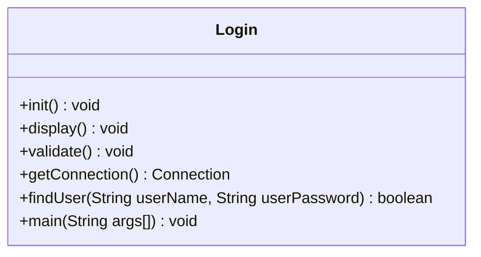

可以看出,这个登陆类有不止一个职责:主函数,与数据库建立链接,查询用户,验证身份.因此需要对这个类进行拆分,便于维护

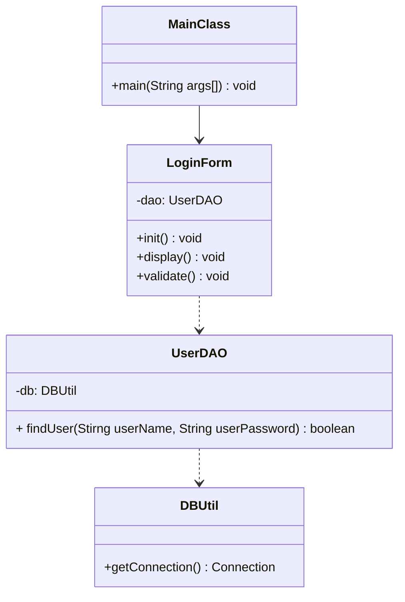

## 开闭原则(Open-Closed Principle, OCP)

**定义**
一个软件实体应当**对扩展开放，对修改关闭**。也就是说在设计一个模块的时候，应当使这个模块可以在不被修改的前提下被扩展，即实现在不修改源代码的情况下改变这个模块的行为。
(Software entities should be open for extension, but
closed for modification.)

### 开闭原则分析

在开闭原则的定义中,**软件实体可以指一个软件模块,一个由多个类组成的局部结构或一个独立的类**

抽象化是开闭原则的关键

开闭原则还可以通过一个更加具体的"对可变性封装"来描述,对可变性封装原则要求找到系统的可变因素并将其封装起来

### 开闭原则实例

某图形界面系统提供了各种不同形状的按钮，客户端代码可针对这些按钮进行编程，用户可能会改变需求要求使用不同的按钮，原始设计方案如图所示

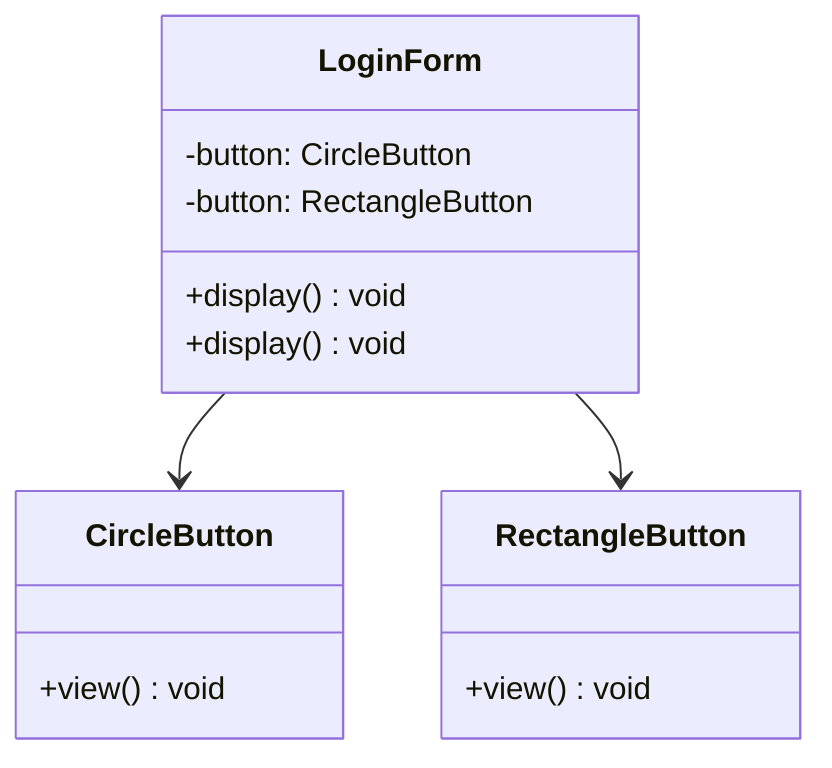

修改以符合开闭原则

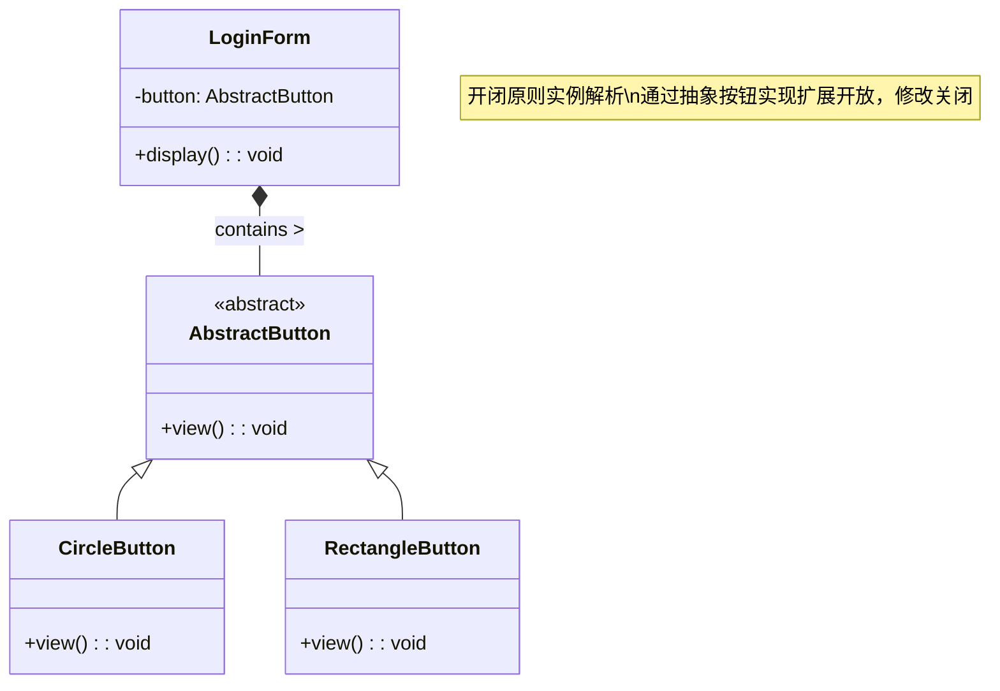

## 里氏代换原则(Liskov Substitution Principle, LSP)

**定义**
如果对每一个类型为S的对象o1，都有类型为T的对象o2，使得
以T定义的所有程序P在所有的对象o2都代换成o1时，程序P的
行为没有变化，那么类型S是类型T的子类型。(If for each object o1 of type S there is an object o2 of type T such
that for all programs P defined in terms of T, the behavior of P is
unchanged when o1 is substituted for o2 then S is a subtype of T)

第二种较容易理解的定义:
所有引用基类（父类）的地方必须能透明地使用其子类的对象
(Functions that use pointers or references to base classes must be
able to use objects of derived classes without knowing it)

### 里氏代换原则分析

里氏代换原则可以通俗表述为：在**软件中如果能够使用基
类对象，那么一定能够使用其子类对象**。把基类都替换成
它的子类，程序将不会产生任何错误和异常，反过来则不
成立，如果一个软件实体使用的是一个子类的话，那么它
不一定能够使用基类。

里氏代换原则是实现开闭原则的重要方式之一，由于使用
基类对象的地方都可以使用子类对象，因此**在程序中尽量
使用基类类型来对对象进行定义，而在运行时再确定其子
类类型，用子类对象来替换父类对象**

### 里氏替换原则实例

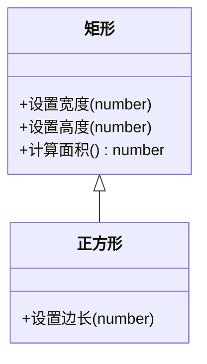

正方形强制继承矩形的设置宽度()和设置高度()方法，导致调用正方形.设置宽度(5)时会隐式修改高度，违反父类行为约定，无法用子类替换父类

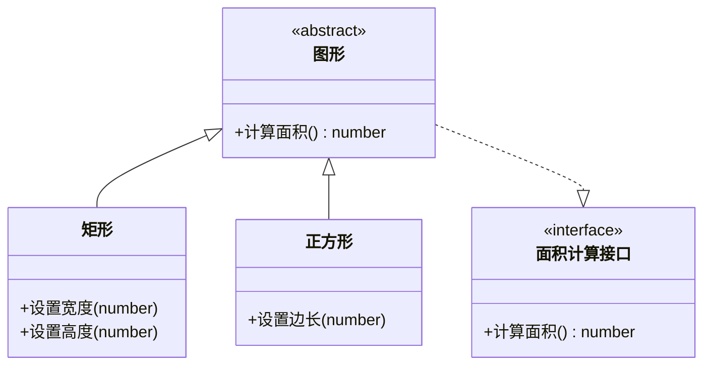

## 依赖倒转原则(Dependence Inversion Principle, DIP)

**定义**
高层模块不应该依赖低层模块，它们都应该依赖抽象。抽象不应该
依赖于细节，细节应该依赖于抽象。(High level modules should not depend upon low level modules, both
should depend upon abstractions. Abstractions should not depend upon
details, details should depend upon abstractions)

另一种定义
要针对接口编程，不要针对实现编程。(Program to an interface, not an implementation)

### 依赖倒转原则分析

简单来说，依赖倒转原则就是指：代码要依赖于抽
象的类，而不要依赖于具体的类；要针对接口或抽
象类编程，而不是针对具体类编程。

实现开闭原则的关键是抽象化，并且从抽象化导出
具体化实现，如果说开闭原则是面向对象设计的目
标的话，那么依赖倒转原则就是面向对象设计的主
要手段

类之间的耦合

- 零耦合关系
- 具体耦合关系
- 抽象耦合关系

依赖倒转原则要求客户端依赖于抽象耦合，以抽象方式耦合是依赖倒转原则的关键

### 依赖倒转原则实例

优化前

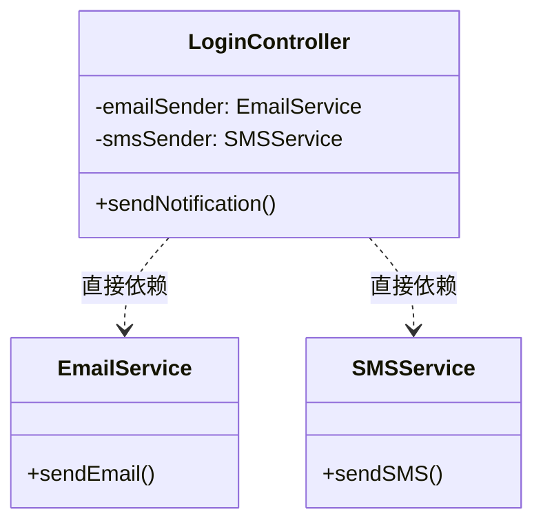

高层模块LoginController直接依赖低层实现EmailService和SMSService，导致：

1. 新增通知方式需修改控制器代码
2. 单元测试需mock具体服务
3. 服务实现变更会影响控制器

优化后

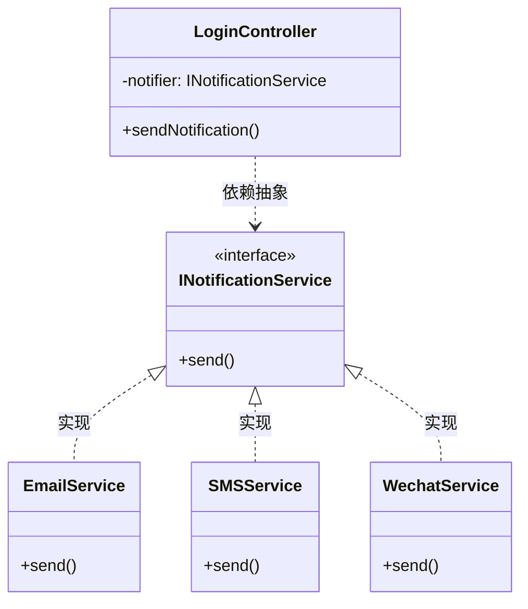

## 接口隔离原则(Interface Segregation Principle, ISP)

**定义**
客户端不应该依赖那些它不需要的接口。(Clients should not be forced to depend upon interfaces that they
do not use)

另一种定义
一旦一个接口太大，则需要将它分割成一些更细小的接口，
使用该接口的客户端仅需知道与之相关的方法即可
(Once an interface has gotten too 'fat' it needs to be split into
smaller and more specific interfaces so that any clients of the
interface will only know about the methods that pertain to them.)

### 接口隔离原则分析

接口隔离原则是指使用**多个专门的接口，而不使用单一
的总接口**。每一个接口应该承担一种相对独立的角色，
不多不少，不干不该干的事，该干的事都要干

1. 一个接口就只代表一个角色，每个角色都有它特定
   的一个接口，此时这个原则可以叫做“角色隔离原则
   ”
2. 接口仅仅**提供客户端需要的行为**，即所需的方法，
   客户端不需要的行为则隐藏起来，应当为客户端提供
   尽可能小的单独的接口，而不要提供大的总接口

使用接口隔离原则拆分接口时，首先必须满足单
一职责原则，将一组相关的操作定义在一个接口
中，且在满足高内聚的前提下，接口中的方法越
少越好

可以在进行系统设计时采用定制服务的方式，即
为不同的客户端提供宽窄不同的接口，只提供用
户需要的行为，而隐藏用户不需要的行为

### 接口隔离原则示例

下图展示了一个拥有多个客户类的系统，在系统中定义
了一个巨大的接口（胖接口）AbstractService来服务
所有的客户类。可以使用接口隔离原则对其进行重构

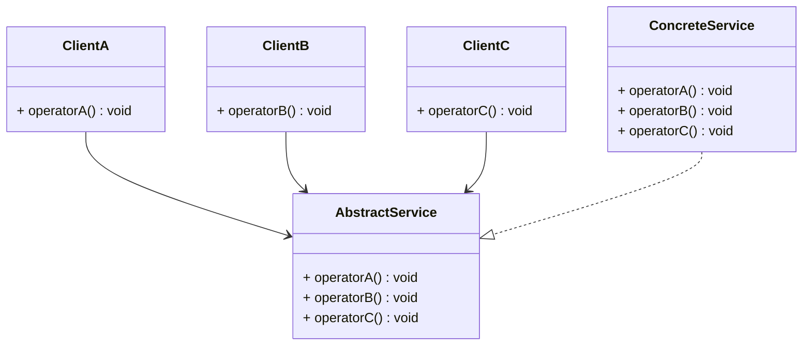

优化后

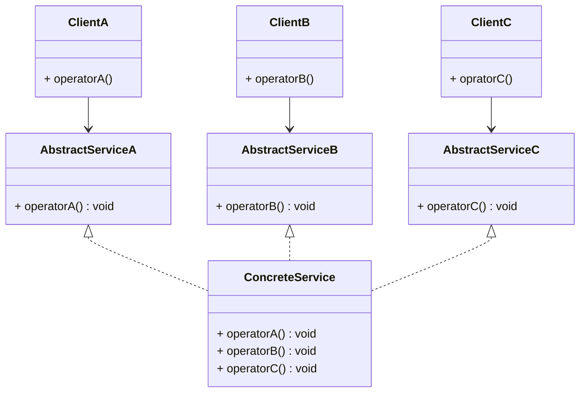

## 合成复用原则(Composite Reuse Principle, CRP) | 组合/聚合复用原则(Composition/ AggregateReuse Principle, CARP)

**定义**
尽量使用对象组合，而不是继承来达到复用的目的(Favor composition of objects over inheritance as a
reuse mechanism)

### 合成复用原则分析

合成复用原则就是指在一个新的对象里通过关联
关系（包括组合关系和聚合关系）来使用一些已
有的对象，使之成为新对象的一部分；新对象通
过委派调用已有对象的方法达到复用其已有功能
的目的。简言之：要**尽量使用组合/聚合关系，少用继承。**

在面向对象设计中，可以通过两种基本方法在不
同的环境中复用已有的设计和实现，即通过组合/
聚合关系或通过继承。

**继承复用**：实现简单，易于扩展。破坏系统的
封装性；从基类继承而来的实现是静态的，不
可能在运行时发生改变，没有足够的灵活性；
只能在有限的环境中使用。（“白箱”复用 ）

**组合/聚合复用**：耦合度相对较低，选择性地调
用成员对象的操作；可以在运行时动态进行。
（“黑箱”复用 ）

组合/聚合可以使系统更加灵活，类与类之间的耦
合度降低，一个类的变化对其他类造成的影响相
对较少，因此一般首选使用组合/聚合来实现复用
；其次才考虑继承，在使用继承时，需要严格遵
循里氏代换原则，有效使用继承会有助于对问题
的理解，降低复杂度，而滥用继承反而会增加系
统构建和维护的难度以及系统的复杂度，因此需
要慎重使用继承复用。

### 合成复用原则示例

某教学管理系统部分数据库访问类设计如图所示

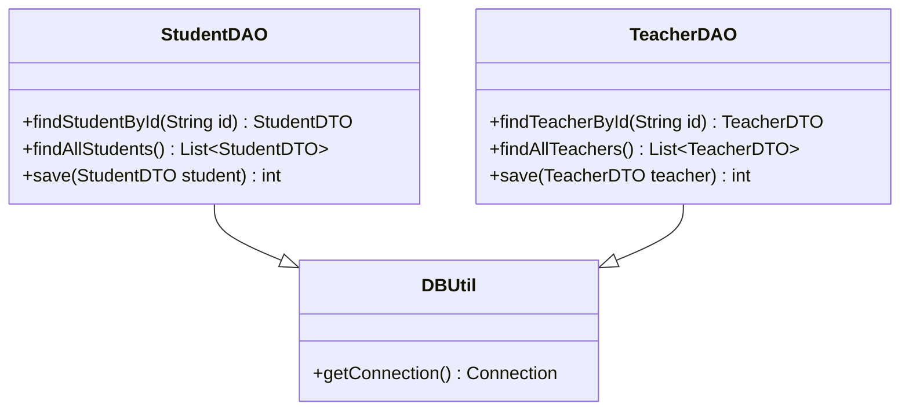

如果需要更换数据库连接方式，如原来采用
JDBC连接数据库，现在采用数据库连接池连接
，则需要修改DBUtil类源代码。如果StudentDAO采用JDBC连接，但是TeacherDAO采
用连接池连接，则需要增加一个新的DBUtil类
，并修改StudentDAO或TeacherDAO的源代码，
使之继承新的数据库连接类，这将违背开闭原
则，系统扩展性较差。
• 现使用合成复用原则对其进行重构

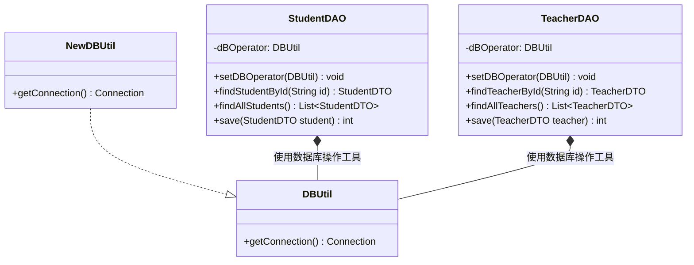

## 迪米特法则(Law of Demeter, LoD) | 最少知识原则(Least Knowledge Principle, LKP)

**定义**

1. 不要和"陌生人"说话(Don't talk to strangers)
2. 只与你的直接朋友通信(Talk only to your immediate friends)
3. 每一个软件单位对其他的单位都只有最少的知识，而且局限于那些与本单位密切相关的软件单位(Each unit should have only
   limited knowledge about other units: only units "closely" related to the current unit)

### 迪米特法则分析

一个软件实体应当尽可能少的与其他实体发生相互作用。这样，当一个模块修改时，就会尽量少的影响其他的模块，扩展会相对容易，这是对软件实体之间通信的限制，它要求限制软件实体之间通信的宽度和深度

在迪米特法则中,对于一个对象,其朋友包括以下几类

1. 当前对象本身
2. 以参数形式传入当前对象方法中的对象
3. 当前对象的成员对象
4. 如果当前对象的成员对象是一个集合,那么集合中的元素也都是朋友
5. 当前对象所创建的对象

迪米特法则可分为狭义法则和广义法则。**在狭义的迪米特
法则中，如果两个类之间不必彼此直接通信，那么这两个
类就不应当发生直接的相互作用**，如果其中的一个类需要
调用另一个类的某一个方法的话，可以通过第三者转发这
个调用。

狭义的迪米特法则：可以降低类之间的耦合，但是会在系统中
增加大量的小方法并散落在系统的各个角落，它可以使一个系
统的局部设计简化，因为每一个局部都不会和远距离的对象有
直接的关联，但是也会造成系统的不同模块之间的通信效率降
低，使得系统的不同模块之间不容易协调

广义的迪米特法则：指对对象之间的信息流量、流向以及信息
的影响的控制，主要是对信息隐藏的控制。信息的隐藏可以使
各个子系统之间脱耦，从而允许它们独立地被开发、优化、使
用和修改，同时可以促进软件的复用，由于每一个模块都不依
赖于其他模块而存在，因此每一个模块都可以独立地在其他的
地方使用。一个系统的规模越大，信息的隐藏就越重要，而信
息隐藏的重要性也就越明显

迪米特法则的主要用途在于控制信息的过载：

在类的划分上，应当尽量创建松耦合的类，类之间的耦
合度越低，就越有利于复用，一个处在松耦合中的类一
旦被修改，不会对关联的类造成太大波及；

在类的结构设计上，每一个类都应当尽量降低其成员变
量和成员函数的访问权限；

在类的设计上，只要有可能，一个类型应当设计成不变
类；

在对其他类的引用上，一个对象对其他对象的引用应当
降到最低

### 迪米特法则实例

某系统界面类(如Form1、Form2等类)与数据访问类(如
DAO1、DAO2等类)之间的调用关系较为复杂，如图所示:

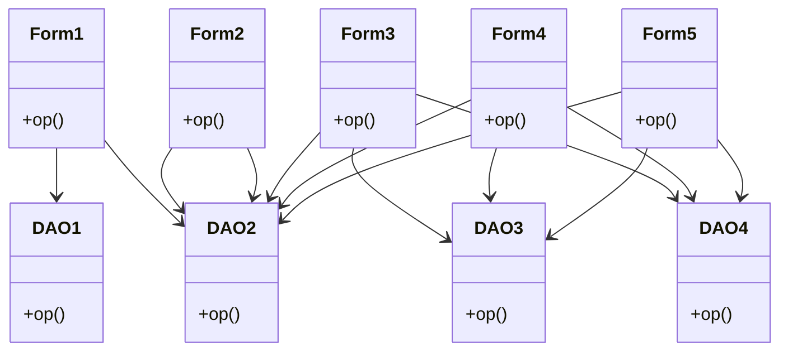

优化后

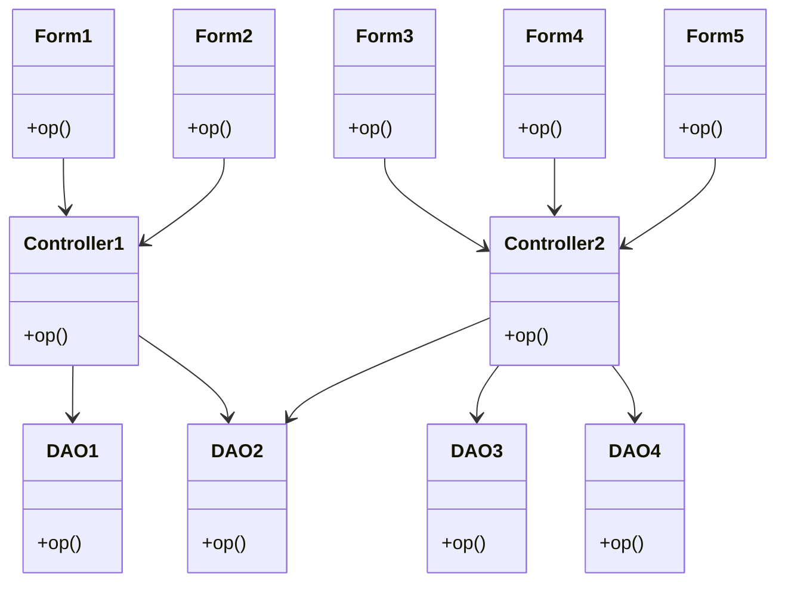

## 小结

目标: 开闭原则

指导: 最小知识原则

基础: 单一职责原则,可变性封装原则

实现:依赖倒转原则,合成复用原则,里氏代换原则,接口隔离原则
