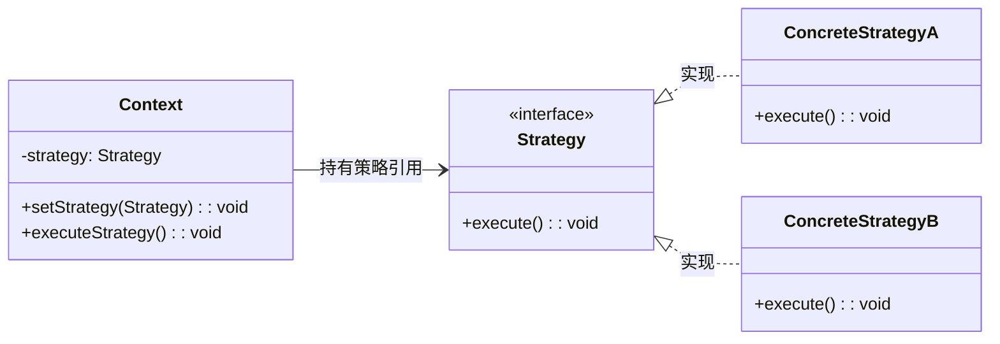

# 模式动机

当系统需要**动态切换算法或行为**时，避免使用大量条件分支（如 if-else 或 switch）。策略模式将每个算法封装成独立类，使得算法可互换、扩展性更强。例如：电商促销（满减、折扣、赠品）、排序算法（快排、归并排序）的灵活切换。

# 模式定义
策略模式(Strategy Pattern)：定义一系列算法，将每个算法封装成独立类，并使它们可以相互替换。策略模式让算法独立于使用它的客户端而变化，属于行为型设计模式。
> Strategy Pattern: Define a family of algorithms, encapsulate each one, and make them interchangeable. Strategy lets the algorithm vary independently of clients that use it.

# 模式结构



---

### **模式结构说明**
1. **Context（上下文）**  
   • 维护对策略对象的引用  
   • 提供 `setStrategy()` 方法动态切换策略  
   • 通过 `executeStrategy()` 委托调用具体策略

2. **Strategy（策略接口）**  
   • 定义算法族的统一接口（如 `execute()`）  
   • 抽象策略行为，与具体实现解耦

3. **ConcreteStrategy（具体策略）**  
   • 实现策略接口的具体算法（如 `ConcreteStrategyA` 和 `ConcreteStrategyB`）  
   • 每个策略类封装独立算法逻辑

# 模式分析
• **关键特性**：  
• **消除条件分支**：通过对象组合替代硬编码的条件逻辑。  
• **开闭原则**：新增策略无需修改已有代码。  
• **算法复用**：不同上下文可共享同一策略对象。

---

# 模式优缺点
**优点**：
1. 避免多重条件判断，代码更简洁
2. 算法可自由扩展，符合开闭原则
3. 算法复用性强（如多个系统共用支付策略）

**缺点**：
1. 策略类数量可能爆炸式增长（需权衡设计粒度）
2. 客户端必须理解不同策略的差异（需增加文档或交互设计）

---

# 模式使用环境
• 系统需要在多种算法中动态选择  
• 需要屏蔽算法细节（如加密算法、压缩算法）  
• 存在大量条件分支判断同一类问题（如根据用户等级计算折扣）

---

# 模式应用
### 场景案例
1. **支付系统**：支付宝、微信支付、银行卡支付的灵活切换
2. **导航系统**：根据实时路况选择最优路径策略（最短距离/最少时间）
3. **游戏AI**：敌人根据玩家行为切换攻击策略

### Java实现方案
**方案1：标准接口模式**
```java
// 策略接口
interface DiscountStrategy {
    double applyDiscount(double price);
}

// 具体策略：满减
class FullReductionStrategy implements DiscountStrategy {
    public double applyDiscount(double price) {
        return price >= 200 ? price - 50 : price;
    }
}

// 上下文类
class ShoppingCart {
    private DiscountStrategy strategy;
    
    public void setStrategy(DiscountStrategy strategy) {
        this.strategy = strategy;
    }
    
    public void checkout(double price) {
        double finalPrice = strategy.applyDiscount(price);
        System.out.println("实付金额：" + finalPrice);
    }
}

// 使用
ShoppingCart cart = new ShoppingCart();
cart.setStrategy(new FullReductionStrategy());
cart.checkout(250); // 输出：实付金额：200.0
```  

**方案2：函数式接口（Java8+）**
```java
// 直接使用Lambda表达式
DiscountStrategy strategy = price -> price * 0.8; // 打8折
cart.setStrategy(strategy);
cart.checkout(100); // 输出：实付金额：80.0
```  

| 实现方式  | 适用场景          | 优势         |  
|-------|---------------|------------|  
| 标准接口  | 复杂策略逻辑        | 面向对象，扩展性强  |  
| 函数式接口 | 简单策略（如Lambda） | 代码简洁，无需定义类 |  

---

# 策略选择与创建
• **策略工厂模式**：通过工厂类封装策略创建逻辑
```java
class StrategyFactory {
    public static DiscountStrategy getStrategy(String type) {
        switch(type) {
            case "FULL_REDUCTION": return new FullReductionStrategy();
            case "PERCENT_DISCOUNT": return price -> price * 0.9;
            default: throw new IllegalArgumentException();
        }
    }
}
```  

• **策略缓存**：对无状态的策略对象使用享元模式复用

---

# 模式扩展
• **与桥接模式对比**：  
• 策略模式侧重**行为替换**，桥接模式侧重**抽象与实现的解耦**  
• 策略模式的Context主动选择策略，桥接模式的抽象层与实现层独立变化

• **组合其他模式**：  
• **工厂模式**：管理策略对象的创建  
• **装饰器模式**：动态叠加策略功能  
• **模板方法模式**：定义算法框架，具体步骤由策略实现
