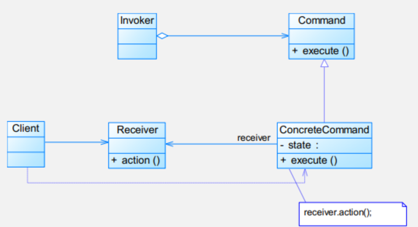
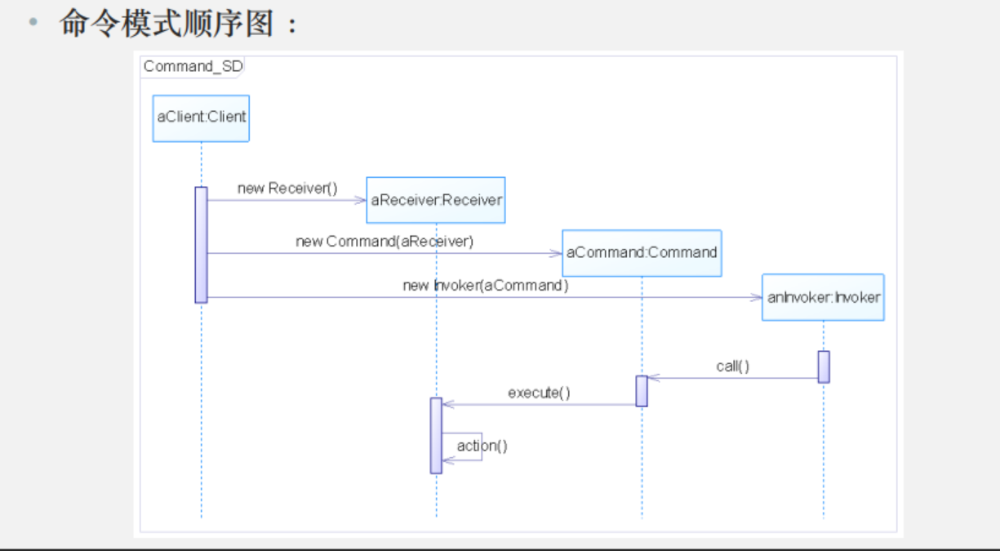

# 模式动机

命令模式可以**对发送者和接收者完全解耦**，发送者与接收者之间**没有直接引用关系，发送请求的对象只需要知道如何发送请求，而不必知道如何完成请求**

# 模式定义

命令模式(Command Pattern)：**将一个请求封装为一个对象，从而使我们可用不同的请求对客户进行参数化；对请求排队或者记录请求日志，以及支持可撤销的操作。**命令模式是一种对象行为型模式，其别名为动作(Action)模式或事务(Transaction)模式

Command Pattern: Encapsulate a request as an object, thereby letting you parameterize clients with different requests, queue or log requests, and support undoable operations.

# 模式结构



命令模式包含以下角色:
- Command:抽象命令类
- ConcreteCommand:具体命令类
- Invoker:调用者
- Receiver:接收者
- Client:客户类

# 模式分析

- 命令模式的本质是**对命令进行封装，将发出命令的责任和执行命令的责任分割开**
- 每一个命令都是一个操作：**请求的一方发出请求，要求执行一个操作；接收的一方收到请求，并执行操作**
- 命令模式允许请求的一方和接收的一方独立开来，**使得请求的一方不必知道接收请求的一方的接口**，更不必知道请求是怎么被接收，以及操作是否被执行、何时被执行，以及是怎么被执行的
- 命令模式使请求本身成为一个对象，这个对象和其他对象一样可以被存储和传递
- 命令模式的关键在于引入了抽象命令接口，且发送者针对抽象命令接口编程，只有实现了抽象命令接口的具体命令才能与接收者相关联



# 模式案例
```java
// 命令接口
interface Command {
    void execute();
}

// 接收者：电灯
class Light {
    public void on() {
        System.out.println("电灯已打开");
    }
    
    public void off() {
        System.out.println("电灯已关闭");
    }
}

// 具体命令：开灯命令
class LightOnCommand implements Command {
    private Light light;
    
    public LightOnCommand(Light light) {
        this.light = light;
    }
    
    @Override
    public void execute() {
        light.on();
    }
}

// 具体命令：关灯命令
class LightOffCommand implements Command {
    private Light light;
    
    public LightOffCommand(Light light) {
        this.light = light;
    }
    
    @Override
    public void execute() {
        light.off();
    }
}

// 调用者：遥控器
class RemoteControl {
    private Command command;
    
    public void setCommand(Command command) {
        this.command = command;
    }
    
    public void pressButton() {
        command.execute();
    }
}

// 演示类
public class SimpleCommandDemo {
    public static void main(String[] args) {
        // 创建电灯（接收者）
        Light light = new Light();
        
        // 创建开灯和关灯命令
        Command lightOn = new LightOnCommand(light);
        Command lightOff = new LightOffCommand(light);
        
        // 创建遥控器（调用者）
        RemoteControl remote = new RemoteControl();
        
        // 测试开灯
        remote.setCommand(lightOn);
        remote.pressButton();  // 电灯已打开
        
        // 测试关灯
        remote.setCommand(lightOff);
        remote.pressButton();  // 电灯已关闭
        
        // 测试宏命令（简化版）
        System.out.println("\n=== 测试一键切换功能 ===");
        Command toggleCommand = new Command() {
            private boolean isOn = false;
            
            @Override
            public void execute() {
                if (isOn) {
                    lightOff.execute();
                } else {
                    lightOn.execute();
                }
                isOn = !isOn;
            }
        };
        
        remote.setCommand(toggleCommand);
        remote.pressButton();  // 电灯已打开
        remote.pressButton();  // 电灯已关闭
        remote.pressButton();  // 电灯已打开
    }
}
```

# 模式优缺点
优点
- 降低系统的耦合度
- 新的命令可以很容易地加入到系统中
- 可以比较容易地设计一个命令队列和宏命令(组合命令)
- 可以方便地实现对请求的Undo和Redo

缺点
- 使用命令模式可能会导致某些系统有过多的具体命令类。因为针对每一个命令都需要设计一个具体命令类，因此某些系统可能需要大量具体命令类，这将影响命令模式的使用。

# 模式适用环境
在以下情况下可以使用命令模式：
- 系统需要将请求调用者和请求接收者解耦，使得调用者和接收者不直接交互
- 系统需要在不同的时间指定请求、将请求排队和执行请求
- 系统需要支持命令的撤销(Undo)操作和恢复(Redo)操作
- 系统需要将一组操作组合在一起，即支持宏命令。

# 模式扩展
- 宏命令又称为组合命令，它是命令模式和组合模式联用的产物
- 宏命令也是一个具体命令，不过它包含了对其他命令对象的引用，在调用宏命令的execute()方法时，将递归调用它所包含的每个成员命令的execute()方法，一个宏命令的成员对象可以是简单命令，还可以继续是宏命令。执行一个宏命令将执行多个具体命令，从而实现对命令的批处理


