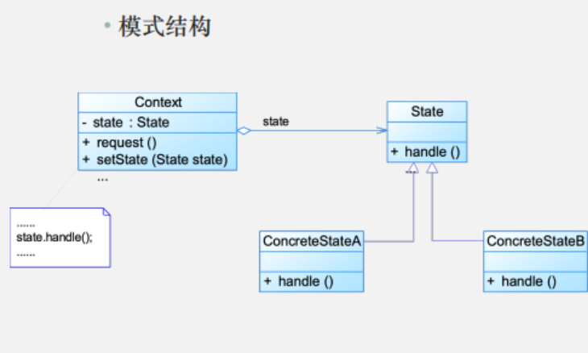

# 模式动机
- 在很多情况下，**一个对象的行为取决于一个或多个动态变化的属性**，这样的属性叫做状态，这样的对象叫做有状态的(stateful)对象，这样的对象状态是从事先定义好的一系列值中取出的。当一个这样的对象与外部事件产生互动时，其内部状态就会改变，从而使得系统的行为也随之发生变化。
- 在UML中可以使用状态图来描述对象状态的变化

# 模式定义
状态模式(State Pattern) ：允许一个对象在其内部状态改变时改变它的行为，对象看起来似乎修改了它的类。其别名为状态对象(Objects for States)，状态模式是一种对象行为型模式。

State Pattern: Allow an object to alter its behavior when its internal state changes. The object will appear to change its class

# 模式结构



- Context:环境类
- State:抽象状态类
- ConcreteState:具体状态类

# 模式分析

- 状态模式描述了**对象状态的变化**以及**对象如何在每一种状态下表现出不同的行为**

- 状态模式的关键是**引入了一个抽象类来专门表示对象的状态**，这个类我们叫做抽象状态类，而对象的每一种具体状态类都继承了该类，**并在不同具体状态类中实现了不同状态的行为，包括各种状态之间的转换**

- 在状态模式结构中需要理解**环境类**与**抽象状态类**的作用
    - 环境类实际上就是拥有状态的对象，环境类有时候可以充当状态管理器(State Manager)的角色，可以**在环境类中对状态进行切换操作**
    - 抽象状态类可以是抽象类，也可以是接口，不同状态类就是继承这个父类的不同子类，**状态类的产生是由于环境类存在多个状态，同时还满足两个条件：这些状态经常需要切换，在不同的状态下对象的行为不同。因此可以将不同对象下的行为单独提取出来封装在具体的状态类中，使得环境类对象在其内部状态改变时可以改变它的行为，对象看起来似乎修改了它的类，而实际上是由于切换到不同的具体状态类实现的。**由于环境类可以设置为任一具体状态类，因此它针对抽象状态类进行编程，在程序运行时可以将任一具体状态类的对象设置到环境类中，从而使得环境类可以改变内部状态，并且改变行为

# 模式案例

```java
import java.util.Scanner;

// 状态接口
interface ElevatorState {
    void openDoor();
    void closeDoor();
    void run();
    void stop();
}

// 具体状态：开门状态
class OpenState implements ElevatorState {
    private final Elevator elevator;
    
    public OpenState(Elevator elevator) {
        this.elevator = elevator;
    }
    
    @Override
    public void openDoor() {
        System.out.println("电梯门已经是开着的，保持开门状态");
    }
    
    @Override
    public void closeDoor() {
        System.out.println("正在关闭电梯门...");
        elevator.setState(elevator.getClosedState());
    }
    
    @Override
    public void run() {
        System.out.println("错误：门开着的时候电梯不能运行！");
    }
    
    @Override
    public void stop() {
        System.out.println("电梯已经是停止状态，保持不动");
    }
    
    @Override
    public String toString() {
        return "开门状态";
    }
}

// 具体状态：关门状态
class ClosedState implements ElevatorState {
    private final Elevator elevator;
    
    public ClosedState(Elevator elevator) {
        this.elevator = elevator;
    }
    
    @Override
    public void openDoor() {
        System.out.println("正在打开电梯门...");
        elevator.setState(elevator.getOpenState());
    }
    
    @Override
    public void closeDoor() {
        System.out.println("电梯门已经是关着的，保持关门状态");
    }
    
    @Override
    public void run() {
        System.out.println("电梯正在运行...");
        elevator.setState(elevator.getRunningState());
    }
    
    @Override
    public void stop() {
        System.out.println("电梯已经是停止状态，保持不动");
    }
    
    @Override
    public String toString() {
        return "关门状态";
    }
}

// 具体状态：运行状态
class RunningState implements ElevatorState {
    private final Elevator elevator;
    
    public RunningState(Elevator elevator) {
        this.elevator = elevator;
    }
    
    @Override
    public void openDoor() {
        System.out.println("错误：电梯运行时不能开门！");
    }
    
    @Override
    public void closeDoor() {
        System.out.println("电梯门已经是关着的，保持关门状态");
    }
    
    @Override
    public void run() {
        System.out.println("电梯已经在运行中，继续运行");
    }
    
    @Override
    public void stop() {
        System.out.println("正在停止电梯...");
        elevator.setState(elevator.getStoppedState());
    }
    
    @Override
    public String toString() {
        return "运行状态";
    }
}

// 具体状态：停止状态
class StoppedState implements ElevatorState {
    private final Elevator elevator;
    
    public StoppedState(Elevator elevator) {
        this.elevator = elevator;
    }
    
    @Override
    public void openDoor() {
        System.out.println("正在打开电梯门...");
        elevator.setState(elevator.getOpenState());
    }
    
    @Override
    public void closeDoor() {
        System.out.println("电梯门已经是关着的，保持关门状态");
    }
    
    @Override
    public void run() {
        System.out.println("电梯正在启动...");
        elevator.setState(elevator.getRunningState());
    }
    
    @Override
    public void stop() {
        System.out.println("电梯已经是停止状态，保持不动");
    }
    
    @Override
    public String toString() {
        return "停止状态";
    }
}

// 上下文类：电梯
class Elevator {
    private ElevatorState currentState;
    private final ElevatorState openState;
    private final ElevatorState closedState;
    private final ElevatorState runningState;
    private final ElevatorState stoppedState;
    
    public Elevator() {
        this.openState = new OpenState(this);
        this.closedState = new ClosedState(this);
        this.runningState = new RunningState(this);
        this.stoppedState = new StoppedState(this);
        // 初始状态：停止状态
        this.currentState = stoppedState;
    }
    
    public void setState(ElevatorState state) {
        this.currentState = state;
    }
    
    public void openDoor() {
        currentState.openDoor();
    }
    
    public void closeDoor() {
        currentState.closeDoor();
    }
    
    public void run() {
        currentState.run();
    }
    
    public void stop() {
        currentState.stop();
    }
    
    // 获取各个状态对象的方法
    public ElevatorState getOpenState() {
        return openState;
    }
    
    public ElevatorState getClosedState() {
        return closedState;
    }
    
    public ElevatorState getRunningState() {
        return runningState;
    }
    
    public ElevatorState getStoppedState() {
        return stoppedState;
    }
    
    public void displayStatus() {
        System.out.println("\n[电梯当前状态]: " + currentState);
    }
}

// 演示客户端
public class StatePatternDemo {
    public static void main(String[] args) {
        Elevator elevator = new Elevator();
        Scanner scanner = new Scanner(System.in);
        
        System.out.println("==== 电梯控制系统 ====");
        System.out.println("命令: o=开门, c=关门, r=运行, s=停止, q=退出");
        
        while (true) {
            elevator.displayStatus();
            System.out.print("请输入命令: ");
            String command = scanner.nextLine().toLowerCase();
            
            if (command.equals("q")) {
                break;
            }
            
            switch (command) {
                case "o":
                    elevator.openDoor();
                    break;
                case "c":
                    elevator.closeDoor();
                    break;
                case "r":
                    elevator.run();
                    break;
                case "s":
                    elevator.stop();
                    break;
                default:
                    System.out.println("无效命令，请重新输入!");
            }
        }
        
        System.out.println("电梯控制系统已关闭");
        scanner.close();
    }
}
```

# 模式优缺点
优点
- **封装了转换规则**
- 枚举可能的状态，在枚举状态之前需要确定状态种类
- 将所有与某个状态有关的行为放到一个类中，并且可以方便地增加新的状态，只需要改变对象状态即可改变对象的行为。
- 允许状态转换逻辑与状态对象合成一体，而不是某一个巨大的条件语句块。
- 可以让多个环境对象共享一个状态对象，从而减少系统中对象的个数

缺点
- 状态模式的使用必然会**增加系统类和对象的个数。**
- 状态模式的结构与实现都较为复杂，如果使用不当将导致程序结构和代码的混乱.
- 状态模式对“开闭原则”的支持并不太好，对于可以切换状
态的状态模式，增加新的状态类需要修改那些负责状态转换的源代码，否则无法切换到新增状态；而且修改某个状态类的行为也需修改对应类的源代码。

# 适用环境

在以下情况下可以使用状态模式:
- 对象的行为依赖于它的状态（属性）并且可以根据它的状态改变而改变它的相关行为。
- 代码中包含大量与对象状态有关的条件语句，这些条件语句的出现，会导致代码的可维护性和灵活性变差，不能方便地增加和删除状态，使客户类与类库之间的耦合增强。在这些条件语句中包含了对象的行为，而且这些条件对应于对象的各种状态

# 模式扩展
- **共享状态**:在有些情况下多个环境对象需要共享同一个状态，如果希望在系统中实现多个环境对象实例共享一个或多个状态对象，那么需要将这些状态对象定义为环境的静态成员对象
- **简单状态模式与可切换状态的状态模式**:
    - 简单状态模式:简单状态模式是指状态都相互独立，状态之间无须进行转换的状态模式。简单的状态模式遵循“开闭原则”，在客户端可以针对抽象状态类进行编程，而将具体状态类写到配置文件中，同时增加新的状态类对原有系统也不造成任何影响
    - 可切换状态的状态模式:大多数的状态模式都是可以切换状态的状态模式，在实现状态切换时，在具体状态类内部需要调用环境类Context的setState()方法进行状态的转换操作，在具体状态类中可以调用到环境类的方法，因此状态类与环境类之间通常还存在关联关系或者依赖关系。通过在状态类中引用环境类的对象来回调环境类的setState()方法实现状态的切换。在这种可以切换状态的状态模式中，增加新的状态类可能需要修改其他某些状态类甚至环境类的源代码，否则系统无法切换到新增状态

