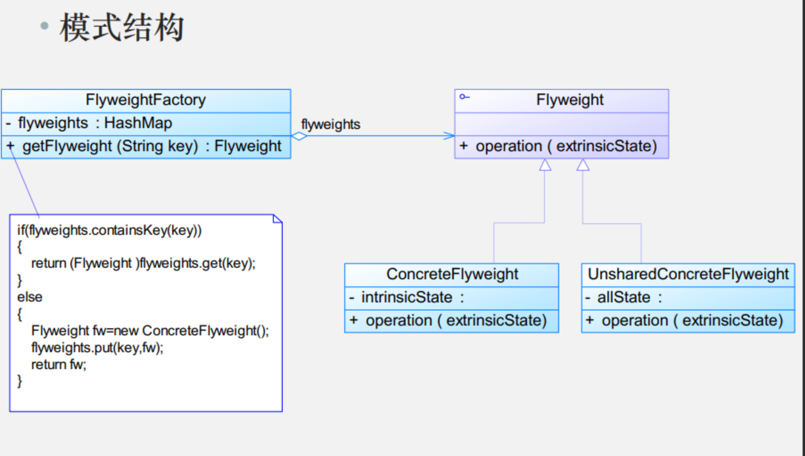

# 模式动机

- 面向对象技术可以很好地解决一些灵活性或可扩展性问题，但在很多情况下需要在系统中增加类和对象的个数。**当对象数量太多时，将导致运行代价过高，带来性能下降等问题**

- 享元模式正是为解决这一类问题而诞生的。**享元模式通过共享技术实现相同或相似对象的重用**

- 在享元模式中**可以共享的相同内容称为内部状态(Intrinsic State)，而那些需要外部环境来设置的不能共享的内容称为外部状态(Extrinsic State)，**由于区分了内部状态和外部状态，因此可以通过设置不同的外部状态使得相同的对象可以具有一些不同的特征，而相同的内部状态是可以共享的

- 在享元模式中通常会出现工厂模式，需要**创建一个享元工厂来负责维护一个享元池(Flyweight Pool)用于存储具有相同内部状态的享元对象。**

- 在享元模式中共享的是享元对象的内部状态，外部状态需要通过环境来设置。在实际使用中，能够共享的内部状态是有限的，因此**享元对象一般都设计为较小的对象，它所包含的内部状态较少，这种对象也称为细粒度对象。享元模式的目的就是使用共享技术来实现大量细粒度对象的复用。**

# 模式定义
享元模式(Flyweight Pattern)：运用共享技术有效地支持大量细粒度对象的复用。系统只使用少量的对象，而这些对象都很相似，状态变化很小，可以实现对象的多次复用。由于享元模式要求能够共享的对象必须是细粒度对象，因此它又称为轻量级模式，它是一种对象结构型模式

Flyweight Pattern: Use sharing to support large numbers of fine-grained objects efficiently. 

# 模式结构



享元模式包含以下角色:
- Flyweight: 抽象享元类
- ConcreteFlyweight: 具体享元类
- UnsharedConcreteFlyweight: 非共享具体享元类
- FlyweightFactory: 享元工厂类

# 模式分析

- 享元模式是一个考虑系统性能的设计模式，通过使用享元模式可以**节约内存空间，提高系统的性能**

- 享元模式的核心在于**享元工厂类，享元工厂类的作用在于提供一个用于存储享元对象的享元池**，用户需要对象时，首先从享元池中获取，**如果享元池中不存在，则创建一个新的享元对象返回给用户，并在享元池中保存该新增对象**

- 享元模式以共享的方式高效地支持大量的细粒度对象，享元对象能做到共享的关键是区分内部状态(Internal State)和外部状态(External State)
    - **内部状态是存储在享元对象内部并且不会随环境改变而改变的状态**，因此内部状态可以共享
    - 外部状态是随环境改变而改变的、不可以共享的状态。享元对象的外部状态必须由客户端保存，并在享元对象被创建之后，在需要使用的时候再传入到享元对象内部。一个外部状态与另一个外部状态之间是相互独立的

# 模式案例

```java
import java.util.*;

// 享元接口 - 字符格式
interface CharacterFormat {
    void display(char c);
}

// 具体享元类 - 字符格式（共享内部状态）
class CharFormat implements CharacterFormat {
    private final String font;      // 字体 (内部状态)
    private final int size;         // 字号 (内部状态)
    private final String color;     // 颜色 (内部状态)

    public CharFormat(String font, int size, String color) {
        this.font = font;
        this.size = size;
        this.color = color;
    }

    @Override
    public void display(char c) {
        System.out.printf("字符: %c | 格式: %s, %dpx, %s%n", c, font, size, color);
    }
    
    @Override
    public String toString() {
        return "格式: " + font + ", " + size + "px, " + color;
    }
}

// 享元工厂 - 创建和管理字符格式对象
class FormatFactory {
    private static final Map<String, CharFormat> formatMap = new HashMap<>();
    
    // 获取格式对象
    public static CharFormat getFormat(String font, int size, String color) {
        // 创建格式的唯一键
        String key = font + size + color;
        
        if (!formatMap.containsKey(key)) {
            CharFormat format = new CharFormat(font, size, color);
            formatMap.put(key, format);
            System.out.println("创建新格式: " + format);
        }
        return formatMap.get(key);
    }
    
    // 获取已创建的格式总数
    public static int getFormatCount() {
        return formatMap.size();
    }
}

// 字符类 - 包含字符内容和格式（外部状态）
class Character {
    private final char charValue;    // 字符内容 (外部状态)
    private final CharFormat format; // 字符格式 (共享内部状态)
    
    public Character(char c, String font, int size, String color) {
        this.charValue = c;
        this.format = FormatFactory.getFormat(font, size, color);
    }
    
    public void display() {
        format.display(charValue);
    }
}

// 文档类 - 包含多个字符
class Document {
    private final List<Character> characters = new ArrayList<>();
    
    public void addCharacter(char c, String font, int size, String color) {
        characters.add(new Character(c, font, size, color));
    }
    
    public void display() {
        System.out.println("\n=== 文档内容 ===");
        for (Character c : characters) {
            c.display();
        }
    }
    
    public int getCharacterCount() {
        return characters.size();
    }
}

// 客户端代码
public class TextEditorDemo {
    public static void main(String[] args) {
        Document doc = new Document();
        
        // 添加标题（使用统一格式）
        for (char c : "享元模式演示".toCharArray()) {
            doc.addCharacter(c, "微软雅黑", 20, "蓝色");
        }
        
        // 添加正文（使用共享格式）
        for (char c : "在文本编辑器中，相同的字符格式可以共享".toCharArray()) {
            if (Character.isWhitespace(c)) {
                doc.addCharacter(c, "宋体", 12, "黑色");
            } else {
                doc.addCharacter(c, "宋体", 12, "黑色");
            }
        }
        
        // 添加重点词（使用不同格式）
        for (char c : "节省内存资源".toCharArray()) {
            doc.addCharacter(c, "黑体", 14, "红色");
        }
        
        // 添加数字（共享格式）
        for (char c : "2023".toCharArray()) {
            doc.addCharacter(c, "Consolas", 12, "深灰色");
        }
        
        // 再次添加相同格式文本
        for (char c : "相同格式共享".toCharArray()) {
            doc.addCharacter(c, "宋体", 12, "黑色");
        }
        
        // 显示文档内容
        doc.display();
        
        // 显示统计数据
        System.out.println("\n===== 系统统计 =====");
        System.out.println("文档总字符数: " + doc.getCharacterCount());
        System.out.println("实际创建的字符格式数: " + FormatFactory.getFormatCount());
    }
}
```

# 模式优缺点
优点:
- 享元模式的优点在于它可以**极大减少内存中对象的数量**，使得相同对象或相似对象在内存中只保存一份
- 享元模式的外部状态相对独立，而且不会影响其内部状态，从而使得享元对象可以在不同的环境中被共享

缺点:
- 享元模式使得系统更加复杂，**需要分离出内部状态和外部状态，这使得程序的逻辑复杂化**
- 为了使对象可以共享，享元模式**需要将享元对象的状态外部化，而读取外部状态使得运行时间变长**

# 模式适用环境
在以下情况下可以使用享元模式:
- 一个系统有大量相同或者相似的对象，由于这类对象的大量使用，造成内存的大量耗费
- 对象的大部分状态都可以外部化，可以将这些外部状态传入对象中
- 使用享元模式需要维护一个存储享元对象的享元池，而这需要耗费资源，因此，应当在多次重复使用享元对象时才值得使用享元模式

# 模式扩展

享元模式与其他模式的联用
- 在享元模式的享元工厂类中通常提供一个静态的工厂方法用于返回享元对象，使用简单工厂模式来生成享元对象
- 在一个系统中，通常只有唯一一个享元工厂，因此享元工厂类可以使用单例模式进行设计
- 享元模式可以结合组合模式形成复合享元模式，统一对享元对象设置外部状态

