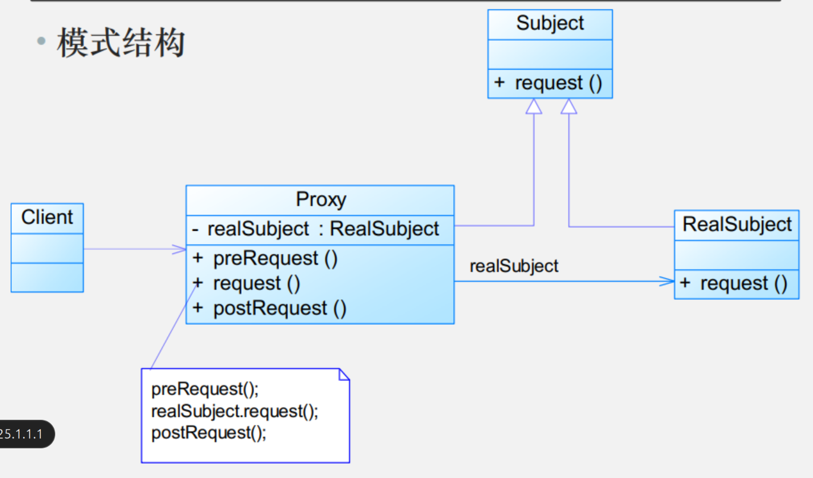

# 模式动机

通过引入一个新的对象来实现对真实对象的操作或者将新的对象作为真实对象的一个替身，这种实现机制即为代理模式，通过引入代理对象来间接访问一个对象，这就是代理模式的模式动机

# 模式定义

代理模式(Proxy Pattern) ：给某一个对象提供一个代理，并由代理对象控制对原对象的引用。代理模式的英文叫做Proxy或Surrogate，它是一种对象结构型模式

Proxy Pattern: Provide a surrogate or 
placeholder for another object to control access
to it

# 模式结构



代理模式包含如下角色:
- Subject: 抽象主题角色
- Proxy: 代理主题角色
- RealSubject: 真实主题角色

# 模式案例

```java
import java.util.*;

// 抽象主题接口
interface Image {
    void display();
}

// 真实主题类
class RealImage implements Image {
    private final String filename;
    
    public RealImage(String filename) {
        this.filename = filename;
        loadFromDisk(); // 创建时立即加载
    }
    
    private void loadFromDisk() {
        System.out.println("正在加载图片: " + filename);
        // 模拟网络加载耗时
        try {
            Thread.sleep(1000);
        } catch (InterruptedException e) {
            e.printStackTrace();
        }
    }
    
    @Override
    public void display() {
        System.out.println("展示图片: " + filename);
    }
}

// 代理类 - 控制对真实图片的访问
class ProxyImage implements Image {
    private RealImage realImage;
    private final String filename;
    private static final Set<String> restrictedFiles = new HashSet<>(Arrays.asList("secret.jpg", "confidential.png"));
    
    public ProxyImage(String filename) {
        this.filename = filename;
    }
    
    @Override
    public void display() {
        // 检查访问权限
        if (!checkAccess()) {
            System.out.println("访问被拒绝: " + filename);
            return;
        }
        
        // 按需加载图片
        if (realImage == null) {
            realImage = new RealImage(filename);
        }
        
        // 展示图片
        realImage.display();
    }
    
    private boolean checkAccess() {
        // 检测是否受限制的文件
        if (restrictedFiles.contains(filename)) {
            System.out.println("尝试访问受限文件: " + filename);
            return false;
        }
        
        // 其他访问控制逻辑可以在这里实现
        return true;
    }
}

// 图片库类 - 客户端使用
class ImageGallery {
    private final List<Image> images = new ArrayList<>();
    
    public void addImage(String filename) {
        images.add(new ProxyImage(filename));
    }
    
    public void displayImage(int index) {
        if (index < 0 || index >= images.size()) {
            System.out.println("无效的图片索引");
            return;
        }
        images.get(index).display();
    }
    
    public void displayAll() {
        System.out.println("\n===== 展示所有图片 =====");
        for (int i = 0; i < images.size(); i++) {
            System.out.println("\n图片 #" + (i + 1));
            images.get(i).display();
        }
    }
}

// 客户端代码
public class ProxyPatternDemo {
    public static void main(String[] args) {
        // 创建图片库
        ImageGallery gallery = new ImageGallery();
        
        // 添加图片
        System.out.println("===== 添加图片到图库 =====");
        gallery.addImage("nature.jpg");
        gallery.addImage("vacation.png");
        gallery.addImage("family.jpg");
        gallery.addImage("secret.jpg");   // 受限图片
        gallery.addImage("confidential.png"); // 受限图片
        gallery.addImage("graduation.jpg");
        
        System.out.println("\n===== 显示第一张图片 =====");
        gallery.displayImage(0);
        
        System.out.println("\n===== 显示受限图片 =====");
        gallery.displayImage(3); // secret.jpg
        gallery.displayImage(4); // confidential.png
        
        System.out.println("\n===== 再次显示第一张图片 =====");
        gallery.displayImage(0); // 不会重新加载
        
        System.out.println("\n===== 显示第六张图片 =====");
        gallery.displayImage(5); // 第一次展示
        
        System.out.println("\n===== 访问所有图片 =====");
        gallery.displayAll();
    }
}
```

# 模式优缺点
优点:
- 代理模式能够协调调用者和被调用者，在一定程度上降低了系统的耦合度
- **远程代理使得客户端可以访问在远程机器上的对象**，远程机器可能具有更好的计算性能与处理速度，可以快速响应并处理客户端请求
- 虚拟代理通过使用一个小对象来代表一个大对象，**可以减少系统资源的消耗，对系统进行优化并提高运行速度**
- 保护代理可以控制对真实对象的使用权限

缺点
- 由于在客户端和真实主题之间增加了代理对象，因此**有些类型的代理模式可能会造成请求的处理速度变慢**
- **实现代理模式需要额外的工作，有些代理模式的实现非常复杂**

# 模式适用环境
根据代理模式的使用目的，常见的代理模式有以下几种类型：
- **远程(Remote)代理**：为一个位于不同的地址空间的对象提供一个本地的代理对象，这个不同的地址空间可以是在同一台主机中，也可是在另一台主机中，远程代理又叫做大使(Ambassador)。
- **虚拟(Virtual)代理**：如果需要创建一个资源消耗较大的对象，先创建一个消耗相对较小的对象来表示，真实对象只在需要时才会被真正创建
- **Copy-on-Write代理**：它是虚拟代理的一种，把复制（克隆）操作延迟到只有在客户端真正需要时才执行。一般来说，对象的深克隆是一个开销较大的操作，Copy-on-Write代理可以让这个操作延迟，只有对象被用到的时候才被克隆
- **保护(Protect or Access)代理**：控制对一个对象的访问，可以给不同的用户提供不同级别的使用权限
- **缓冲(Cache)代理**：为某一个目标操作的结果提供临时的存储空间，以便多个客户端可以共享这些结果。
- **防火墙(Firewall)代理**：保护目标不让恶意用户接近。
- **智能引用(Smart Reference)代理**：当一个对象被引用时，提供一些额外的操作，如将此对象被调用的次数记录下来等
