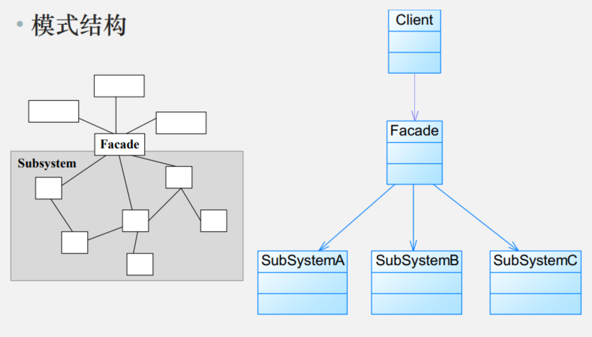

# 模式动机

- 引入外观角色之后，用户只需要直接与外观角色交互，用户与子系统之间的复杂关系由外观角色来实现，从而降低了系统的耦合度

# 模式定义

外观模式(Facade Pattern)：外部与一个子系统的通信必须通过一个**统一的外观对象**进行，为子系统中的一组接口提供一个一致的界面，外观模式定义了一个高层接口，这个接口使得这一子系统更加容易使用。外观模式又称为门面模式，它是一种对象结构型模式

Facade Pattern: Provide a unified interface to a set of interfaces in a subsystem. Facade defines a higher-level interface that makes the subsystem easier to use.

# 模式结构



外观模式包含如下角色:
- Facade:外观角色
- SubSystem:子系统角色

# 模式分析

- 根据“单一职责原则”,**软件中将一个系统划分为若干个子系统有利于降低整个系统的复杂性，**一个常见的设计目标是使子系统间的通信和相互依赖关系达到最小，而达到该目标的途径之一就是引入一个外观对象，它为子系统的访问提供了一个简单而单一的入口。

- 外观模式也是“迪米特法则”的体现，**通过引入一个新的外观类可以降低原有系统的复杂度，同时降低客户类与子系统类的耦合度。**

- 外观模式要求一个子系统的外部与其内部的通信通过一个统一的外观对象进行，外观类将客户端与子系统的内部复杂性分隔开，使得**客户端只需要与外观对象打交道，而不需要与子系统内部的很多对象打交道。**

- 外观模式的目的在于降低系统的复杂程度

- 外观模式从很大程度上提高了客户端使用的便捷性，使得客户端无须关心子系统的工作细节，通过外观角色即可调用相关功能。

# 模式案例

```java
// 子系统：投影仪
class Projector {
    public void on() {
        System.out.println("投影仪打开");
    }

    public void wideScreenMode() {
        System.out.println("投影仪设置为宽屏模式");
    }

    public void off() {
        System.out.println("投影仪关闭");
    }
}

// 子系统：音响系统
class SoundSystem {
    public void on() {
        System.out.println("音响系统打开");
    }

    public void setVolume(int level) {
        System.out.println("音响音量设置为：" + level);
    }

    public void off() {
        System.out.println("音响系统关闭");
    }
}

// 子系统：灯光控制
class Lighting {
    public void dim(int brightness) {
        System.out.println("灯光调暗至：" + brightness + "%");
    }

    public void on() {
        System.out.println("灯光打开");
    }
    
    public void off() {
        System.out.println("灯光关闭");
    }
}

// 子系统：DVD播放器
class DvdPlayer {
    public void on() {
        System.out.println("DVD播放器打开");
    }

    public void play(String movie) {
        System.out.println("开始播放电影：" + movie);
    }

    public void stop() {
        System.out.println("DVD播放停止");
    }

    public void off() {
        System.out.println("DVD播放器关闭");
    }
}

// 外观类：家庭影院外观
class HomeTheaterFacade {
    private Projector projector;
    private SoundSystem soundSystem;
    private Lighting lighting;
    private DvdPlayer dvdPlayer;

    public HomeTheaterFacade(Projector projector, 
                            SoundSystem soundSystem, 
                            Lighting lighting, 
                            DvdPlayer dvdPlayer) {
        this.projector = projector;
        this.soundSystem = soundSystem;
        this.lighting = lighting;
        this.dvdPlayer = dvdPlayer;
    }

    // 封装看电影的复杂操作
    public void watchMovie(String movie) {
        System.out.println("===== 准备看电影 =====");
        lighting.dim(10);
        projector.on();
        projector.wideScreenMode();
        soundSystem.on();
        soundSystem.setVolume(50);
        dvdPlayer.on();
        dvdPlayer.play(movie);
    }

    // 封装结束电影的复杂操作
    public void endMovie() {
        System.out.println("===== 结束观影 =====");
        dvdPlayer.stop();
        dvdPlayer.off();
        soundSystem.off();
        projector.off();
        lighting.on();
    }
}

// 客户端代码
public class FacadePatternDemo {
    public static void main(String[] args) {
        // 创建子系统组件
        Projector projector = new Projector();
        SoundSystem soundSystem = new SoundSystem();
        Lighting lighting = new Lighting();
        DvdPlayer dvdPlayer = new DvdPlayer();

        // 创建外观对象
        HomeTheaterFacade homeTheater = 
            new HomeTheaterFacade(projector, soundSystem, lighting, dvdPlayer);

        // 使用外观接口简化操作
        homeTheater.watchMovie("阿凡达");
        System.out.println("\n===== 观看电影中... =====\n");
        homeTheater.endMovie();
    }
}
```

# 模式优缺点

优点
- **对客户屏蔽子系统组件，减少了客户处理的对象数目并使得子系统使用起来更加容易。**通过引入外观模式，客户代码将变得很简单，与之关联的对象也很少
- **实现了子系统与客户之间的松耦合关系**，这使得子系统的组件变化不会影响到调用它的客户类，只需要调整外观类即可
- **降低了大型软件系统中的编译依赖性，并简化了系统在不同平台之间的移植过程**，因为编译一个子系统一般不需要编译所有其他的子系统。一个子系统的修改对其他子系统没有任何影响，而且子系统内部变化也不会影响到外观对象
- **只是提供了一个访问子系统的统一入口，并不影响用户直接使用子系统类**

缺点
- 不能很好地限制客户使用子系统类，如果对客户访问子系统类做太多的限制则减少了可变性和灵活性
- 在不引入抽象外观类的情况下，增加新的子系统可能需要修改外观类或客户端的源代码，违背了“开闭原则”

# 模式适用环境

在以下情况下可以使用外观模式:
- **当要为一个复杂子系统提供一个简单接口时可以使用外观模式。**该接口可以满足大多数用户的需求，而且用户也可以越过外观类直接访问子系统。
- 客户程序与多个子系统之间存在很大的依赖性。引入外观类将子系统与客户以及其他子系统解耦，可以提高子系统的独立性和可移植性
- 在层次化结构中，可以**使用外观模式定义系统中每一层的入口，层与层之间不直接产生联系，而通过外观类建立联系，降低层之间的耦合度**

# 模式扩展

- 不要通过继承一个外观类在子系统中加入新的行为，这种做法是错误的。外观模式的用意是为子系统提供一个集中化和简化的沟通渠道，而不是向子系统加入新的行为，新的行为的增加应该通过修改原有子系统类或增加新的子系统类来实现，不能通过外观类来实现
- **外观模式创造出一个外观对象，将客户端所涉及的属于一个子系统的协作伙伴的数量减到最少，使得客户端与子系统内部的对象的相互作用被外观对象所取代**外观模式就是实现代
码重构以便达到“迪米特法则”要求的一个强有力的武器
- 外观模式最大的缺点在于违背了“开闭原则”，当增加新的子系统或者移除子系统时需要修改外观类，可以通过引入抽象外观类在一定程度上解决该问题，客户端针对抽象外观类进行编程

