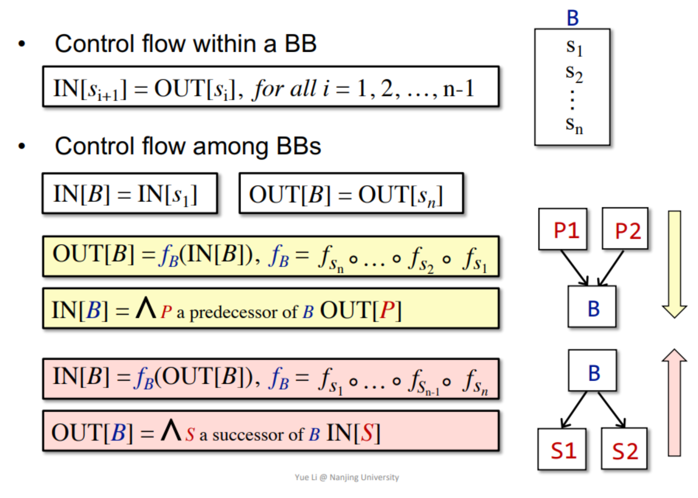
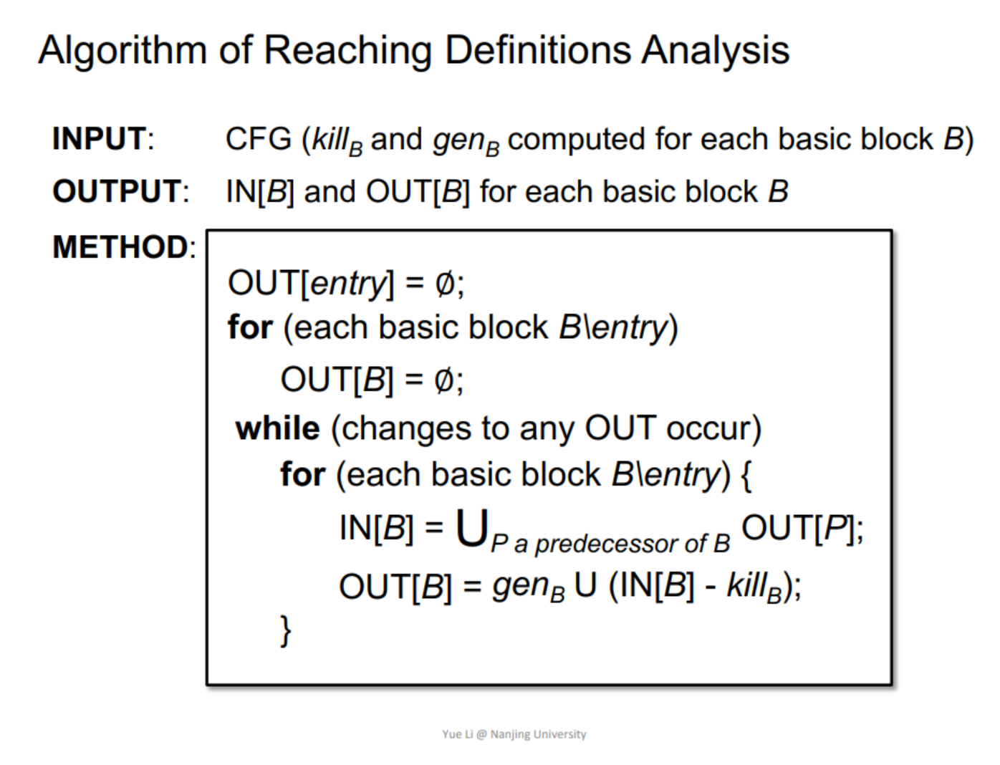

## 关键词

- may analysis vs must analysis
- forward analysis vs backward analysis
- Reaching Definitions Analysis

## 数据流分析(Data Flow Analysis)

### OverView Of Data Flow Analysis

**may analysis**: outputs information that may be true(over-approximation)

**must analysis**:outputs information that must be true (under-approximation)

Over- and under-approximations are both for safety of analysis

different data-flow analysis applications have
different **data abstraction** and
different **flow safe-approximation strategies**.
different **transfer functions** and control-flow handlings

### Preliminaries of Data Flow Analysis

- Input and Output States
  - Each execursion of an IR statement transforms an **input state** to a new **output state**.
  - The input(output) state is associated with thee **program point** before (after)  the statement.

In each data-flow analysis application, we associate with every program point a data-flow value that represents an abstraction of the set of all possible program states that can be observed for that point.

The set of possible data-flow values is the **domain** for this application.

Data-flow analysis is to find a solution to a set of safe-approximation directed constraints on the IN[s]’s and OUT[s]’s, for all statements s.

- constraints based on semantics of statements (transfer functions)
- constraints based on the flows of control

### Transfer Function

Forward Analysis 前向分析

- OUT[s] = fs(IN[s])

Backward Analysis 后向分析

- IN[s] = fs(OUT[s])

### Control Flow‘s Constraints

## Reaching Definitions Analysis

A definition d at program point p reaches a point q if there is a path
from p to q such that d is not “killed” along that path

- A definition of a variable v is a statement that assigns a value to v
- Translated as: definition of variable v at program point p reaches point q if there is a path from p to q such that no new definition of v appears on that path

- Reaching definitions can be used to detect possible undefined variables. e.g., introduce a dummy definition for each variable v at the entry of CFG, and if the dummy definition of v reaches a point p where v is used, then v may be used before definition (as undefined reaches v)

> 可以从语义的角度理解

### **为什么这个迭代算法会终止**

OUT[S] = gens U (IN[S] - kills)

> 这是一个非严格递增数

- genS and killS remain unchanged
- When more facts flow in IN[S], the “more facts” either
  - is killed, or
  - flows to OUT[S] (survivorS)
- When a fact is added to OUT[S], through either genS, or survivorS , it stays there forever
- Thus OUT[S] never shrinks.
- As the set of facts is finite (e.g., all definitions in the program),there must exist a pass of iteration during which nothing is added to any OUT, and then the algorithm terminates
