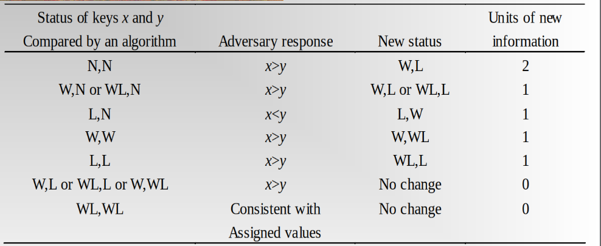
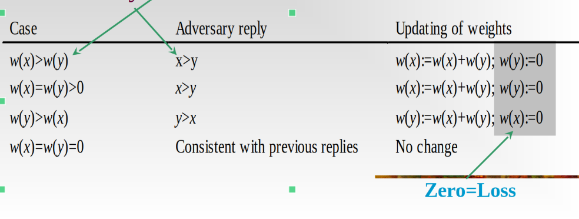

# 对抗策略

**核心思想**: 在算法分析中，假设存在一个​​**自适应的对手（Adversary）**​​，在算法执行过程中动态调整输入数据，​​**最大化算法的代价​​**（如比较次数）.

**目的**:证明问题的时间复杂度下界(即任何算法在最坏情况下必须达到的最小代价)

**特点**:

1. 适应性:对手根据算法的操作实时决定数据响应
2. 最坏情况导向:强制算法达到理论最差性能
3. 信息论视角: 通过限制信息获取量证明下界

## 经典问题

### 问题 1：同时求最大值与最小值​

**目标**​​：在含 n 个元素的数组中，用最少的​​比较次数​​同时找到最大值和最小值。

**朴素方法**: 分别求最大最小,需2n-2次比较

**对抗策略**:每组比较(ai,aj)时,对手总是让ai>aj(或反之),使结果无法提供更多的信息

对于每个元素,设置三个状态N(未知),W(大于某个元素),L(小于某个元素)
经过充分比较之后,最大元素状态为W,最小元素状态为L,其它元素状态为WL.信息总量为2n-2

可见,当比较的元素均为N(未知)状态时,获得的信息最多,因此我们将数组分为2部分,进行比较,保证每次比较均为N,N.操作数为n/2,获取的信息数为n

经过第一轮比较之后不存在状态为N的元素,而剩下的比较最多只能获取1单位信息,因此至少需要n-2步比较.

比较总次数为n/2+n-2

### 问题 2:求数组中第二大的元素​

**目标**​​：用最少的​​比较次数​​找到严格小于最大值的元素（允许重复值）。

**朴素方法**:

- 先找最大元素(需n-1次比较)
- 在剩余元素中找最大(作为第二大,需n-2次比较)
- 总计:2n-3次比较

**对抗策略**:

- 当元素 x 与当前已知最大值比较时，对手声明 x<max
- 当 x 与其他元素比较时，对手让其获胜(保持 x 的竞争力)

分析:第二大元素不能在比较中输给除了最大值以外的其他元素(即第二大元素只能是直接输给最大值的元素)

给每个元素分配权重w(x),初始化均为1,权重总和为n

x为最大元素,则x比较之后唯一的非零权重元素,w(x)=n.由对抗策略:wk(x)<= 2wk-1(x),让k等于与x比较过的元素: n=wk(x)<=2^k w0(x)=2^k因此k>=lgn

在lgn中经过比较可得到第二大元素,因此总操作次数为n+lgn-2.
