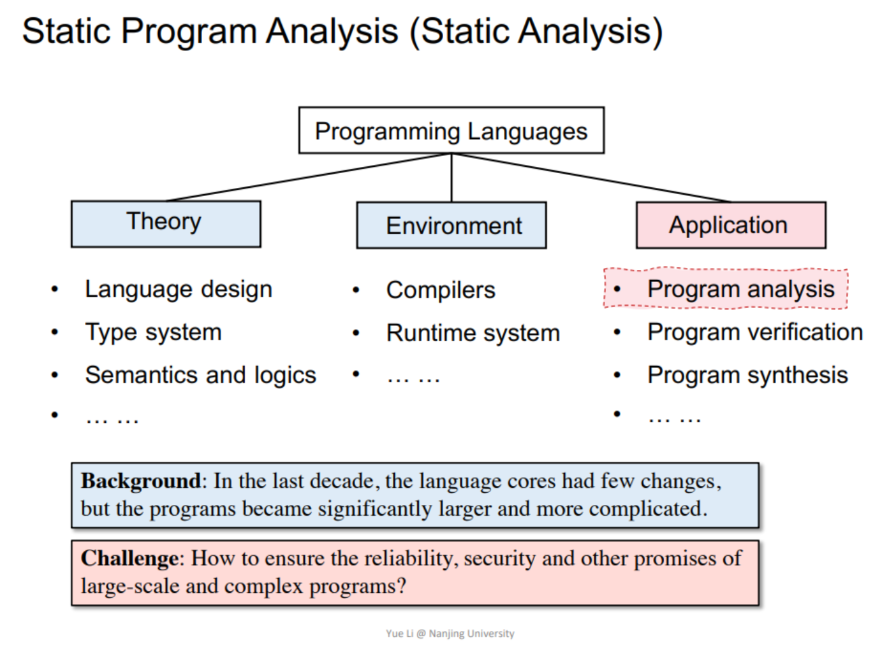
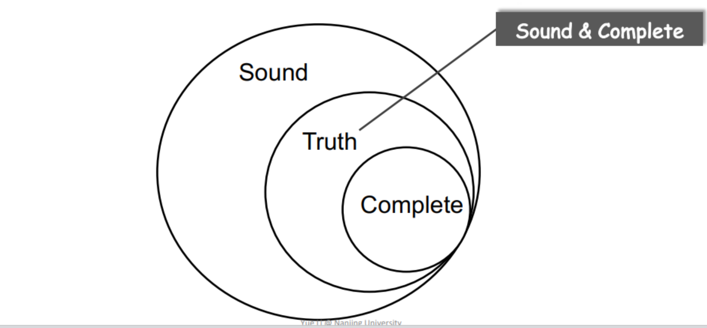

### 本节课关键词

- 静态程序分析(static program analysis)
- Soundness vs. Completeness

## 从程序语言到静态程序分析

## 为什么我们需要静态程序分析

- 程序可靠性:空指针引用,内存泄漏,数组越界等
- 程序安全性:SQL注入,隐私数据泄漏
- 编译优化:常量传播,死代码消除,循环不变代码外提等
- 程序理解:IDE 调用层次结构、类型指示等

> 对于不从事研究的人,你也可以更深入地理解编程语言的语法语义,自然而然地写出更可靠,更安全,更高效的代码.

## 静态程序分析

静态分析通过分析程序 P 来推断其行为，并在运行 P 之前确定它是否满足某些属性。

> 不幸的是,根据Rice's定理,对于大多数有趣的属性(non-trivial properties),没有通用的算法可以决定程序是否满足该属性.

### Rice's定理

“Any non-trivial property of the behavior of 
programs in a r.e. language is undecidable.”

> “任何递归可枚举语言中程序行为的非平凡属性都是不可判定的.”

r.e. (recursively enumerable) = recognizable by a Turing-machine

non-trivial properties
~= interesting properties
~= the properties related with run-time behaviors of programs

A property is trivial if either it is not satisfied by any r.e. language, or if it is satisfied by all r.e. languages; otherwise it is non-trivial.

### Soundness vs. Completeness

Soundness: If the analysis says "yes", then the program really has the property.(如果分析说“是”，那么程序确实具有该属性。)

Completeness: If the program has the property, then the analysis says "yes".(如果程序具有该属性，则分析说“是”。)

> 用通俗的语言来说,Soundness是绝对不会漏报,Completeness是绝对不会误报.
Useful static analysis

- Compromise soundness (false negatives)妥协soundness,会造成漏报
- Compromise completeness (false positives)妥协completeness,会造成误报

Mostly compromising completeness:
Sound but not fully-precise static analysis

Soundness的重要性:

### 鸟瞰静态分析的目标

在确保健全性的前提下,尽可能地提高分析的精确度和速度.

### 两个词概括静态分析

- 抽象(Abstraction): 忽略程序的某些细节,只关注与分析目标相关的细节.
- 过近似(Over-approximation): 例如转换函数,控制流等
  - 转换函数(Transfer function):在静态分析中,转换函数定义了如何将程序状态从一个点转换到另一个点,通常是通过抽象的方式来表示程序的行为.转换函数需要根据语义来设计.
    - 控制流(Control flow):程序中不同部分的执行顺序,通常通过控制流图(CFG)来表示.(由于在实践中不可能枚举所有路径，因此在大多数静态分析中，流合并（作为一种过度近似的方式）被视为理所当然。)
