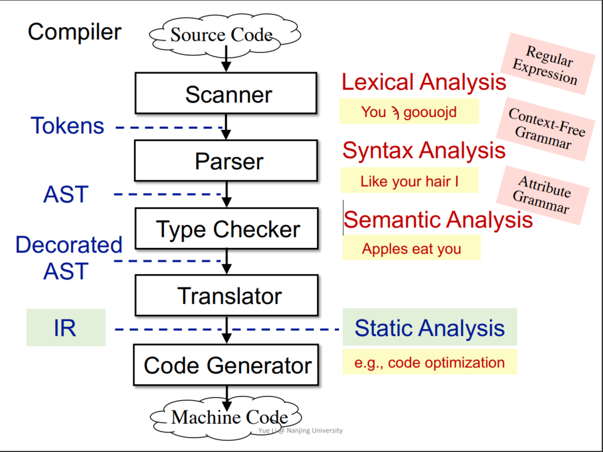

## 本节课关键词

1. Compilers and Static Analyzers
2. AST vs. IR
3. IR: Three-Address Code (3AC)
4. 3AC in Real Static Analyzer: Tai-e
5. Static Single Assignment (SSA)
6. Basic Blocks (BB)
7. Control Flow Graphs (CFG)

## 编译的过程

## AST VS IR

- AST(Abstract Syntax Tree,抽象语法树)
  - 高层级且接近语法结构
  - 通常是依赖于语言的
  - 适合快速类型检查
  - 缺少控制流信息

- IR(Intermediate Representation,中间表示)
  - 低层级且接近机器代码
  - 通常是语言无关的
  - 紧凑并且均匀
  - 包含控制流信息
  - 通常做为静态分析的基础

## 三地址码(TAC)

三地址码是一种常见的中间表示形式,它将每个指令限制为**最多**三个地址(操作数).

## 静态单赋值(SSA)

- Give each definition a fresh name
- Propagate fresh name to subsequent uses
- Every variable has exactly one definition

### SSA的优缺点

优点

- 流信息被间接地纳入到唯一变量名称中.可能有助于实现一些更简单的分析，例如，流不敏感分析通过 SSA 获得流敏感分析的部分精度
- 定义和使用对是明确的在某些按需任务中实现更有效的数据事实存储和传播.某些优化任务在 SSA 上表现更好（例如，条件常量传播、全局值编号

缺点

- SSA 可能引入过多的变量和 phi 函数
- 转换为机器码时可能引入效率问题（由于复制操作）

## 控制流图(CFG)

- 控制流图的节点是基本快
- 块A和块B之间有一条边,如果控制可以
  -从A的末尾直接转移到B的开头
  -B紧接着A且A没有以非条件跳转结束

A是B的前驱(predecessor),B是A的后继(successor)

通常我们添加两个节点：入口节点和出口节点。

- 它们不对应于可执行的 IR
- 从入口节点到包含 IR 首条指令的 BB 的边(一条边)
- 从任意包含可能是 IR 最后一条指令的 BB 到出口节点的边(可能有多条边)

### 基本块(Basic Block)

Basic blocks (BB) are maximal sequences of consecutive three-address instructions with the properties that

- It can be entered only at the beginning, i.e., the first instruction in the block
- It can be exited only at the end, i.e., the last instruction in the block

#### 基本快构建算法

INPUT: a sequence of three-address instructions of P

OUTPUT: a set of basic blocks of P

METHOD:

**Determine the leaders in P:**

- The first instruction in P is a leader
- Any target instruction of a conditional or unconditional jump is a leader
- Any instruction that immediately follows a conditional or unconditional jump is a leader

**Build BBs for P:**

- A BB consists of a leader and all its subsequent instructions until the next leader
