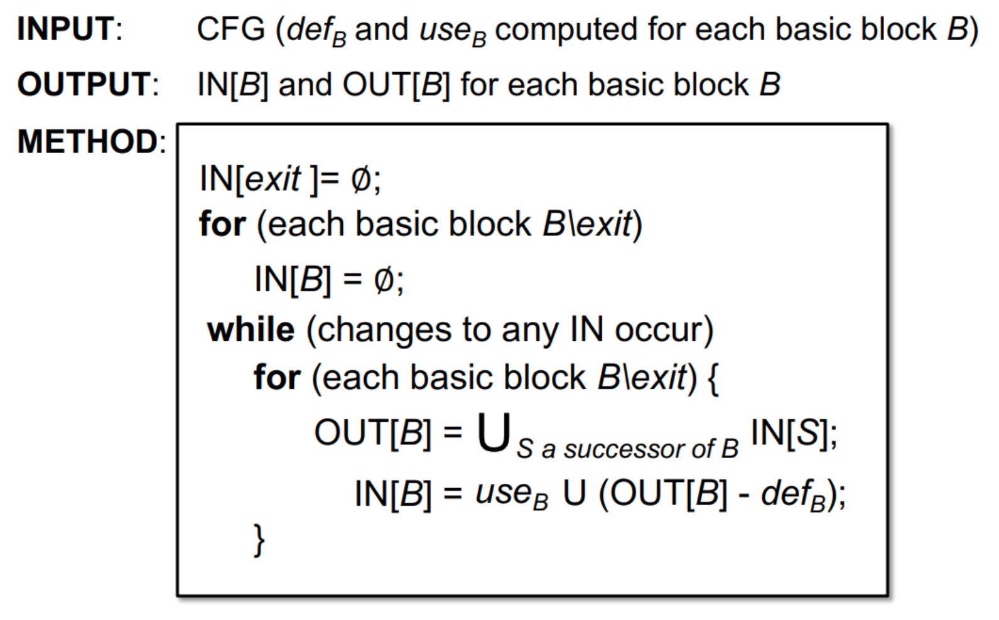

## 关键词

- Live Variables Analysis
- Available Expressions Analysis
- Analysis Comparison

## Live Variables Analysis

Live variable analysis tells whether the value of **variable v** at program point p could be used along some path in CFG starting at p.
If so, v is live at p; otherwise, v is dead at p.

> 显然是may analysis.

Abstraction:use bit vectors represented the live variables at each program point.

> 使用反向分析比较合适.

### Transfer Function

OUT[B] = Union of IN[S] for all successors S of B

IN[B] = USE[B] U (OUT[B] - DEF[B])

> 转换函数是如何区分先定义后使用和先使用后定义的?构造 USE[B]、DEF[B] 时，不是简单地“块里所有用到的变量”和“块里所有定义的变量”。它们有一个 扫描顺序：从基本块的入口往出口顺序扫描指令：如果遇到 x = ... 且 x 还不在 DEF[B] 中，那么把 x 加入 DEF[B]。如果在扫描时用到了某个变量 y，并且 y 还没在 DEF[B] 中（即这个块内还没有在它之前定义过），那么把 y 加入 USE[B]。这意味着：如果一个变量在块中先用后定义，那么它会被加入到 USE[B]（因为用的时候还没被定义）。如果一个变量在块中先定义后使用，那么这个变量不会出现在 USE[B] 里（因为使用的时候入口的值已经被覆盖掉了）。

### Algorithm-Live Variables Analysis



useB 和 defB 是不变的,如果out[B] 增大则IN[B] 一定增大,又因为存在上界,所以算法一定收敛.

## Available Expressions Analysis

An expression x op y is available at program point p if (1) all paths
from the entry to p must pass through the evaluation of x op y, and (2)
after the last evaluation of x op y, there is no redefinition of x or y

> 显然是must analysis.前向分析

例

```c
a = b + c
```

Add to OUT the expression x op y (gen)
• Delete from IN any expression involving variable a (kill)

OUT[B] = GEN[B] U (IN[B] - KILL[B])

IN[B] = Intersection of OUT[P] for all predecessors P of B

> All paths from entry to point p must pass through the evaluation of x op y

### Algorithm-Available Expressions Analysis


> 在可用表达式分析中，谁后出现谁说了算：先 kill 再 gen ⇒ 可用，先 gen 再 kill ⇒ 不可用。

因为kill和gen不变,如果IN[B] 减小则OUT[B] 一定减小,又因为存在下界,所以算法一定收敛.

## Analysis Comparison


