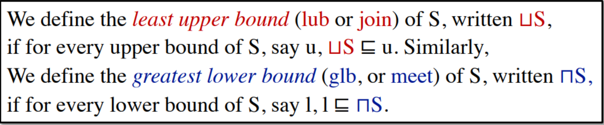
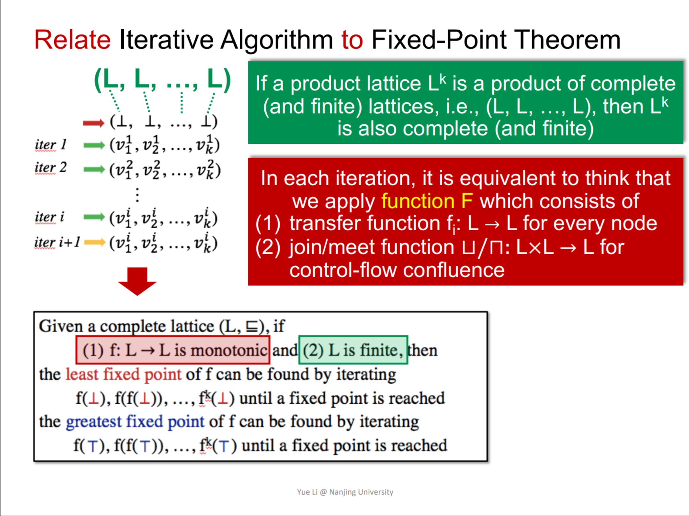
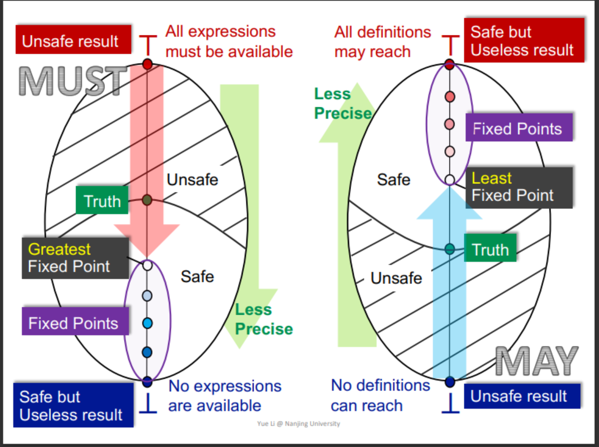
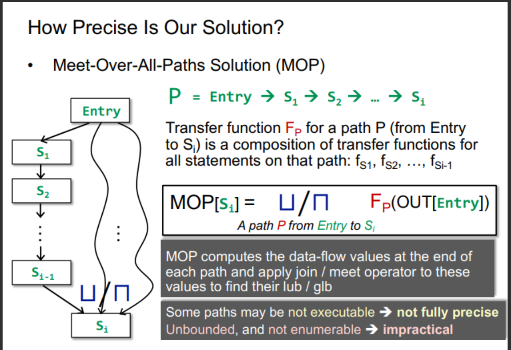
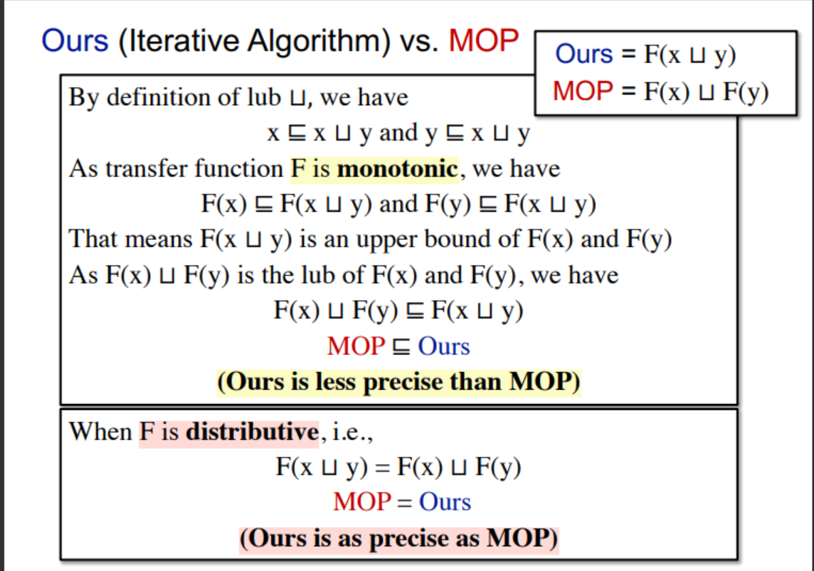
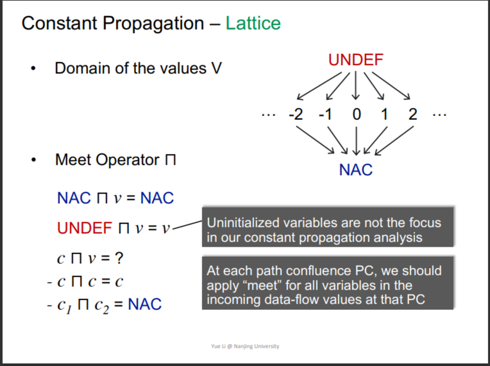
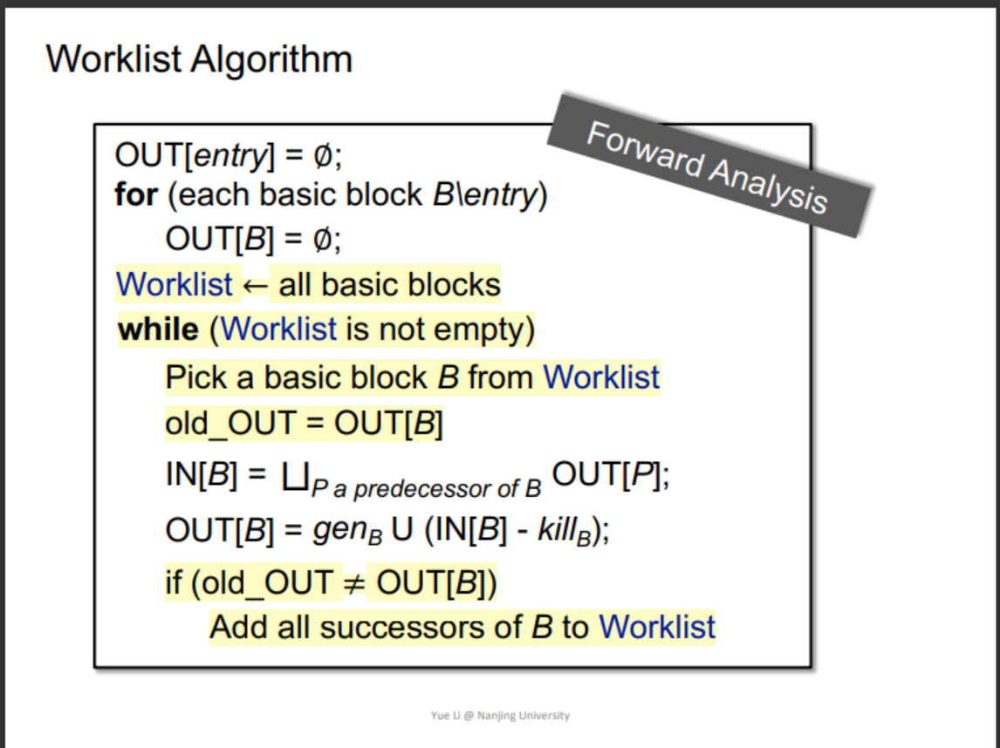

## 关键词

1. Iterative Algorithm, Another View
2. Partial Order
3. Upper Bound and Lower Bound
4. Lattice, Semilattice, Complete and Product Lattice
5. Data Flow Analysis Framework via Lattice
6. Monotonicity and Fixed Point Theorem

## View Iterative Algorithm in Another Way

Given a CFG (program) with k nodes, the iterative algorithm
updates OUT[n] for every node n in each iteration.

Assume the domain of the values in data flow analysis is V,
then we can define a k-tuple
as an element of set (V1 × V2 … × Vk) denoted as Vk

Each iteration can be considered as taking an action to map
an element of Vk to a new element of Vk
, through applying the transfer functions and control-flow handing, abstracted
as a function F: Vk → Vk

Then the algorithm outputs a series of k-tuples iteratively
until a k-tuple is the same as the last one in two consecutive
iterations

> X is a fixed point of F if F(X) = X

## Partial Order


## Upper abd Lower Bounds




### Some Properties

* not every poset has lub or glb

* But if a poset has lub or glb it will be unique

> 通过反对称性可证

## Lattice

A poset (V, ≤) is a lattice if every pair of elements in V has both a lub and a glb.

## Semilattice

if only lub exists,then P is called a join semilattice.

if only glb exists,then P is called a meet semilattice.

## Complete Lattice

A poset (V, ≤) is a complete lattice if every `subset` of V has both a lub and a glb.

Every complete lattice P has a greatest element (denoted as ⊤) and a least element (denoted as ⊥).

Every finite lattice is a complete lattice.

> 程序分析关注的通常是有穷的complete lattice.

## Product Lattice(直积格)


* A Product lattice is a lattice.

* if a product lattice L is a prouct of complete lattices, then L is alse complete.

## Data Flow Analysis Framework via Lattice

A data flow analysis framework (D, L, F) consists of:

* D: a direction of data flow: forwards or backwards

* L: a lattice including domain of the values V and a meet ⊓ or join ⊔ operator

* F: a family of transfer functions from V to V

Data flow analysis can be seen as iteratively applying transfer
functions and meet/join operations on the values of a lattice.

## Monotonicity and Fixed Point Theorem

**Monotonicity**: onotonicity
A function f: L → L (L is a lattice) is monotonic if ∀x, y ∈ L,
x ⊑ y ⟹ f(x) ⊑ f(y)

**Fixed Point Theorem**: Given a complete lattice (L, ⊑), if

(1) f: L → L is monotonic

(2) L is finite

the least fixed point of f can be found by iterating
f(⊥), f(f(⊥)), …, fk(⊥) until a fixed point is reached

the greatest fixed point of f can be found by iterating
f(⊤), f(f(⊤)), …, fk(⊤) until a fixed point is reached.

```text
Proof:
By the definition of ⊥ and f: L → L, we have

⊥ ⊑ f(⊥)

As f is monotonic, we have
f(⊥) ⊑ f(f(⊥)) = f2(⊥)

By repeatedly applying f, we have an ascending chain

⊥ ⊑ f(⊥) ⊑ f2(⊥) ⊑ … ⊑ fi
(⊥)

As L is finite (its height is H), the values are bounded among

⊥ , f(⊥) , f2(⊥) … fH(⊥)

When i > H, by pigeonhole principle, there exists k and j that

fk(⊥) = fj(⊥) (assume k < j ≤ H+1)

Further as fk(⊥) ⊑ … ⊑ fj
(⊥) (monotonicity of f), we have
fFix = fk(⊥) = fk+1(⊥)=...fj(⊥)(proof by contradiction)

Thus, the fixed point exists.
```

Least Fixed Point proof

```text
Proof:
Assume we have another fixed point x, i.e., x = f(x)

By the definition of ⊥, we have ⊥ ⊑ x

Induction begins:
As f is monotonic, we have f(⊥) ⊑ f(x)

Assume fi(⊥) ⊑ fi(x), as f is monotonic, we have
fi+1(⊥) ⊑ fi+1(x)

Thus by induction, we have
fi(⊥) ⊑ fi(x)

Thus fi(⊥) ⊑ fi(x) = x (as x is a fixed point regardless of i),
then we have
fFix = fk(⊥) ⊑ fk(x) = x

Thus the fixed point is the least.
```

## Relate Iterative Algorithm to Fixed Point Theorem



### Proof Function F is Monotonic

In each iteration, it is equivalent to think that we apply function F
which consists of

(1) transfer function fi
: L → L for every node

(2) join/meet function ⊔/⊓: L×L → L for control-flow confluence

```text
Proof:
∀x, y, z ∈ L, x ⊑ y, we want to prove x ⊔ z ⊑ y ⊔ z
by the definition of ⊔, y ⊑ y ⊔ z
by transitivity of ⊑, x ⊑ y ⊔ z
thus y ⊔ z is an upper bound for x, and also for z (by ⊔’s definition)
as x ⊔ z is the least upper bound of x and z
thus x ⊔ z ⊑ y ⊔ z
```

## When will the Algotithm Reach the fixed Point?

The height of a lattice h is the length of the longest path from Top to Bottom.

In each iteration, assume only one step
in the lattice (upwards or downwards) is
made in one node (e.g., one 0->1 in RD)

Assume the lattice height is h and the
number of nodes in CFG is k

We need at most i = h*k iterations.

## May and Must Analyses, a Lattice View



## How Precise is Our Solution?

**Meet-Over-All-Paths Solution (MOP)**:

### Iterative Algorithm vs. MOP



## Constant Propagation

Given a variable x at program point p,determine whether x is guaranteed to hold a constant value at p.

The OUT of each node in CFG, includes a set of pairs (x,v) where x is a variable and v is a value held by x after that node.

> A data flow analysis framework (D, L, F) consists of:
>
>• D: a direction of data flow: forwards or backwards
>
>• L: a lattice including domain of the values V and a
>meet ⊓ or join ⊔ operator
>
>• F: a family of transfer functions from V to V



Transfer Function

Given a statement s: x=..., we define its transfer function F as 

`F: OUT[s] = gen ∪ (IN[s] – {(x, _)})`

(we use val(x) to denote the lattice value that variable x holds)

• s: x = y; gen = {(x, val(y))}

• s: x = y op z; gen = {(x, f(y,z))}

f(y,z) =

1. val(y) op val(z) // if val(y) and val(z) are constants

2. NAC // if val(y) or val(z) is NAC

3. UNDEF // otherwise(if s is not an assignment statement, F is the identity function)

## Worklist Algorithm

> an optimization of the iterative algorithm



