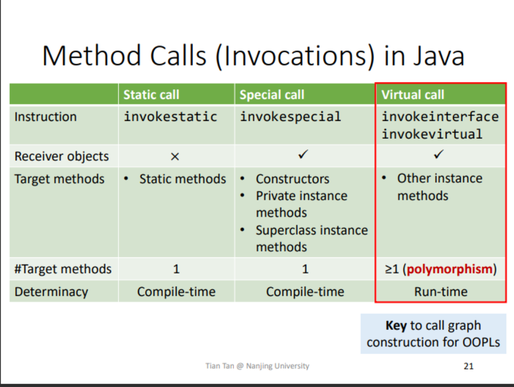
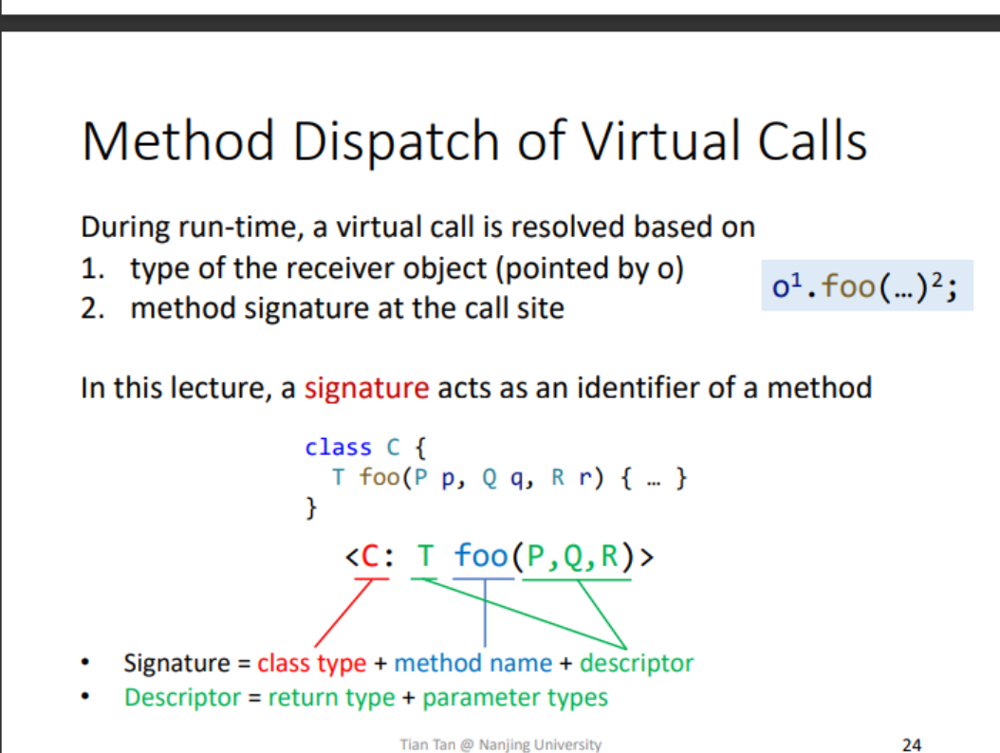
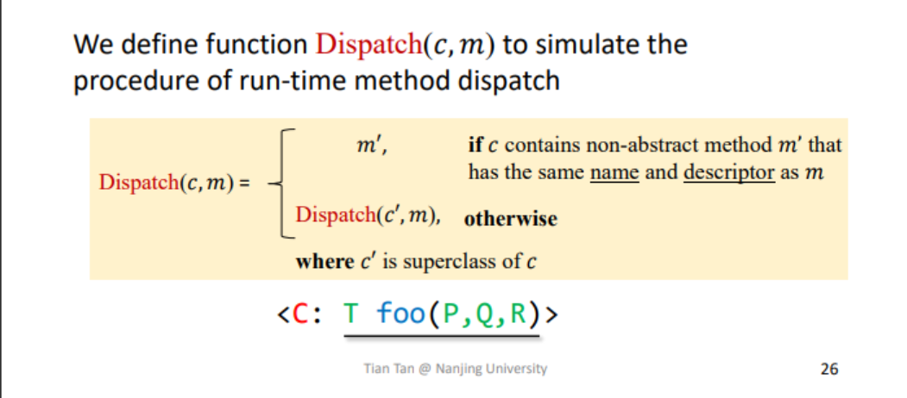
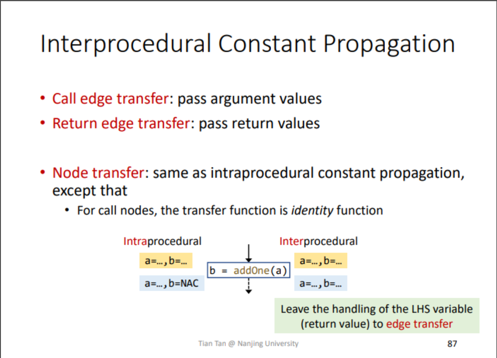

## Main content

- Motivation
- Call Graph
- Interprocedural Control-Flow Graph
- Interprocedural Data-Flow Analysis
- Interprocedural constant propagation

## Motivation

过程内分析(Intraprocedural analysis) Make the most conservative assumption for method calls,for safe-approximation Source of imprecision.

过程间分析(Interprocedural analysis) propagate data-flow information along interprocedural control-flow edges.

## Call Graph

a representatioin of calling relationships in the program.

Applications:

- Foundation of all interprocedural analysis.

- debug

- test

Call Graph COnstruction for OOPLs (focus on Java):

- Class hierachy analysis(CHA)

- Rapid type analysis(RTA)

- Variable type analysis(VTA)

- pointer analysis(k-CFA)

> 从上到下:效率到精确

### Method call(Invocation) in Java



### Method Dispatch of Virtual Calls



use C.foo(P,Q,R) for short.

procedure of Dispatch



### Class Hierarchy Analysis(CHA)

Require the class hierarchy information (inheritance structure) 
of the whole program

Resolve a virtual call based on the declared type of receiver variable of the call site

```java
A a = ...
a.foo();
```

Assume the receiver variable a may point to objects of class A
or all subclasses of A

Resolve target methods by looking up the class hierarchy of class A

#### Call Resolution of CHA

We define function Resolve(cs) to resolve possible target methods of a call site cs by CHA

```c
Resolve(cs)
    T = {}
    m = method signature at cs
    if cs is static call then
        T = {m}
    if cs is special call then
        c^m = class type of m
        T = {Dispatch(c^m, m)}
    if cs is virtual call then
        c = declared type of receiver variable at cs
        for each class c' that is a subclass of c or c itself do
            add Dispatch(c',m) to T
    return T
```

### Feature of CHA

- Advantage: fast
  - Only consider the declared type of receiver variable at the call-site, and its inheritance hierarchy
  - Ignore data- and control-flow information

- Disadvantage: imprecise
  - Easily introduce spurious target methods
  - Addressed in next letures

### Call Graph Construction

Build call Graph for whole progarm via CHA

- Start from entry methods (focus on main method)

- For each reachable method m, resolve target methods for each call site cs in m via CHA(Resovle(cs))

- Repeat untiol no new method is discovered

```Algorithm

BuildCallGraph(m^entry)
  WL = [m^entry]
  CG = {}
  RM = {}
  while WL is not empty do
    remove m from WL
    if m not in RM then
        add m to RM
        for each call site cs in m do
            T = Resolve(cs) 
            for each target method m' in T do
              add cs -> m' to CG
              add m' to WL
    return CG

WL: Work list, containing the methods to be processed

CG: Call graph, a set of call edges

RM: A set of reachable methods
```

## Interprocedural Control-Flow Graph

- CFG represents structure of an individual method

- ICFG represents structure of the whole program

- An ICFG a preogram consists of CFGs of the methods in the program, plus two kinds of additional edges:

  - Call edges: from a call site to the entry node of the target method

  - Return edges: from exit node of a method to the statement following the call site

> ICFG = CFG + call & return edges

## Interprocedural Data-Flow Analysis

过程内分析建立在控制流图上,需要节点内转换函数

过程间分析建立在过程间控制流图上,需要node transfer+edge transfer

Edge transfer:

- Call edge transfer: transfer data flow from call site to the entry node of callee (along call edges)

- Return edge transfer: transfer data flow from exit node of the callee to the return site (along return edges)

### Interprocedural Constant Propagation



Call-to-return edges allow the analysis to propagate local data-flow.

for call-to-return edge,`kill the value of the LHS variable of the call site`. Its value will flow to return site along the return edges. Otherwise, it may cause imprecision.

